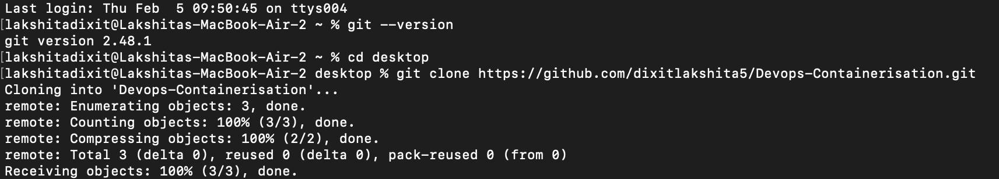

# Devops-Containerisation

## Experiment 0 

### WSL Installation

Mac users do not require to install **WSL** on their system as they can directly use docker through their terminal, hence this experiment is skipped.

### Docker Installation

1. Install Docker Desktop for Mac,
Docker Desktop was downloaded and installed from the official Docker website.<br>
Since macOS supports Docker natively, WSL is not required.
 
2. Open Docker Desktop Application on your Mac from selecting it from applications.

3. Verify your Docker installation by running the command `docker --version`<br>
You can see _Containers : 3_ in the output and also the docker version.


### Git Installation

#### Commands used

```bash
sudo apt install git -y
git --version
```



Thank you