# Devops-Containerisation

Name: Lakshita Dixit  
SAP : 500125823
School of Computer Science  
University of Petroleum and Energy Studies, Dehradun  


## Experiment 1

Comparison of Virtual Machines (VMs) and Containers using Ubuntu and Nginx

#### _NOTE_

This experiment is performed on a **MAC OS** system - _Apple Silcon M2_

### Objective 

To understand the conceptual and practical differences between Virtual Machines and Containers.

1. To install and configure a Virtual Machine using VirtualBox and Vagrant on Windows.
2. To install and configure Containers using Docker Desktop on macOS.
3. To deploy an Ubuntu-based Nginx web server in both environments.
4. To compare resource utilization, performance, and operational characteristics of VMs and Containers.

### Software and Hardware Requirements

#### Hardware

1. 64-bit system with virtualization support enabled in BIOS
2. Minimum 8 GB RAM (4 GB minimum acceptable)
3. Internet connection

#### Software : _MAC OS_

1. Oracle VirtualBox (Intel Macs only)
2. Vagrant
3. Docker Desktop 


### Theory 

#### Virtual Machine 

A Virtual Machine emulates a complete physical computer, including its own operating system kernel, hardware drivers, and user space. Each VM runs on top of a hypervisor.

#### Characteristics:

- Full OS per VM
- Higher resource usage
- Strong isolation
- Slower startup time

#### Container

Containers virtualize at the operating system level. They share the host OS kernel while isolating applications and dependencies in user space.

#### Characteristics:

- Shared kernel
- Lightweight
- Fast startup
- Efficient resource usage

## PART - A : Vagarant on MAC OS


## PART - B : Containers using Docker Desktop

#### Step 1: Install VirtualBox
Oracle VirtualBox was installed to manage virtual machines.

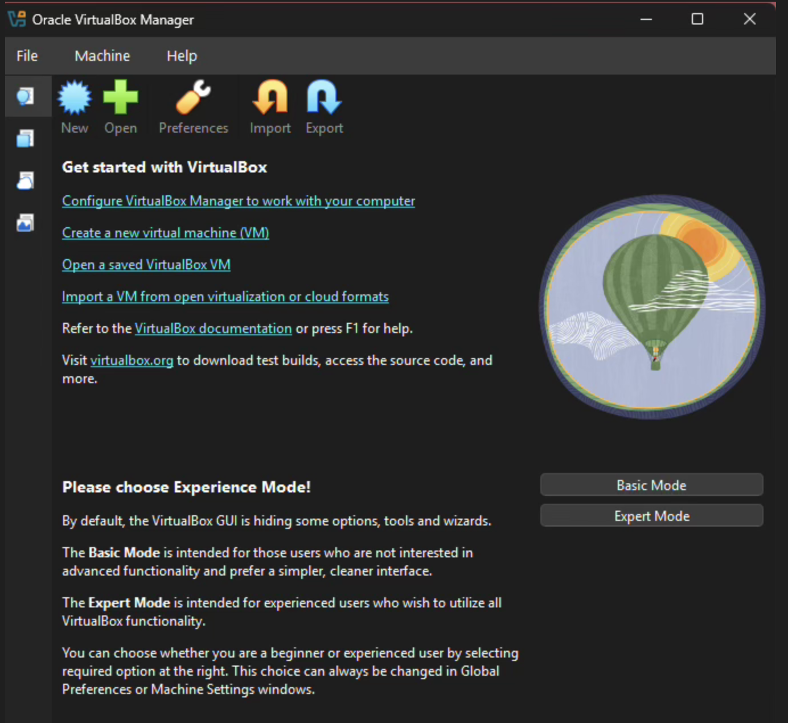

---

#### Step 2: Install Vagrant
Vagrant was installed to automate VM creation.

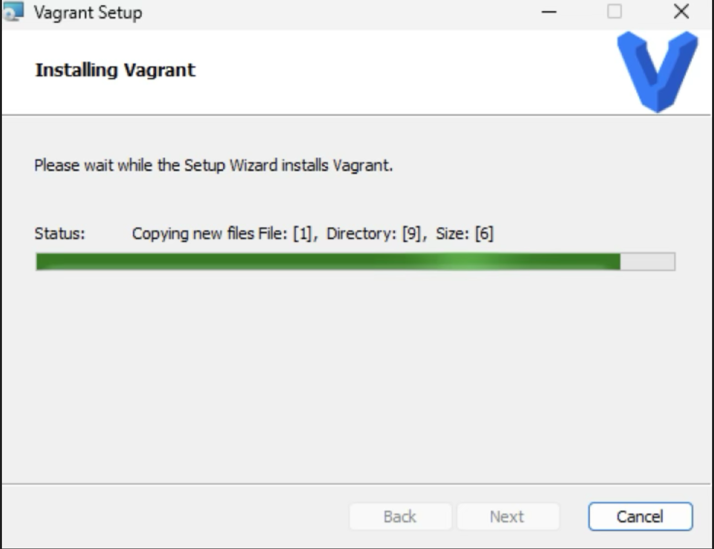

---

#### Step 3: Verify Vagrant Installation

```bash
vagrant --version
```
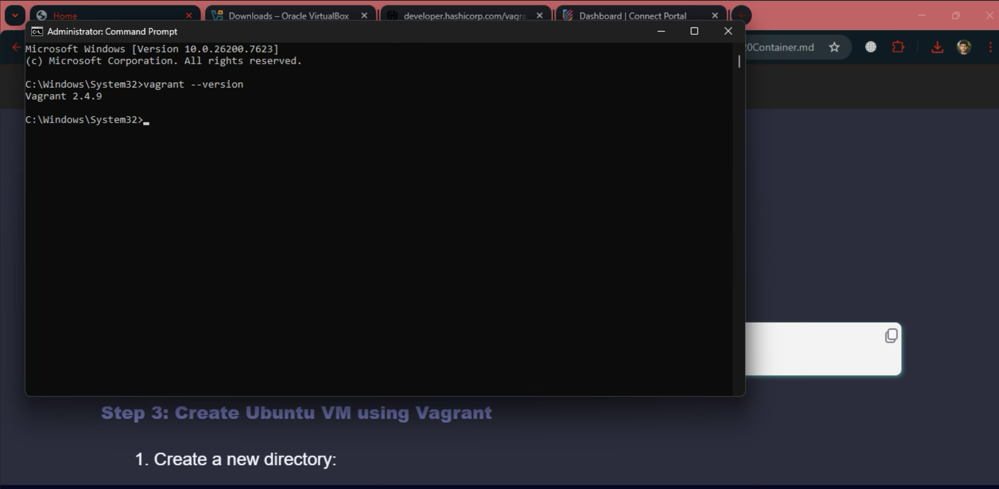
#### Step 4: Initialize Ubuntu Virtual Machine

```bash
vagrant init ubuntu/jammy64
```
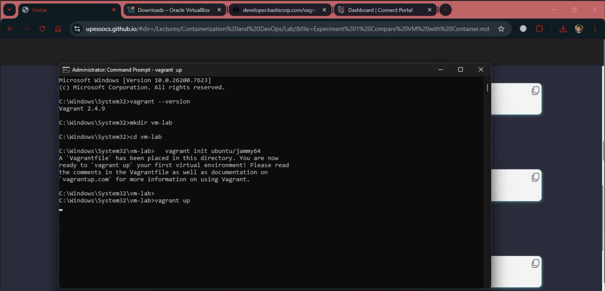


#### Step 5: Start the Virtual Machine
```bash
vagrant up
```
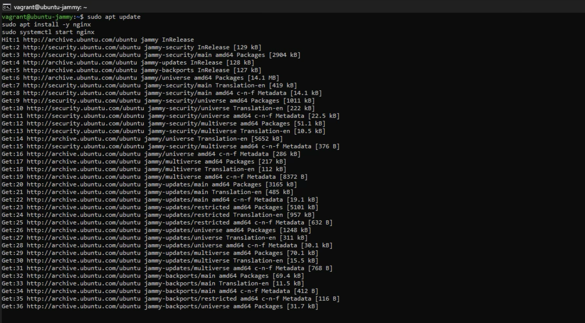

#### Step 6: Access Ubuntu VM
```bash
vagrant ssh
```
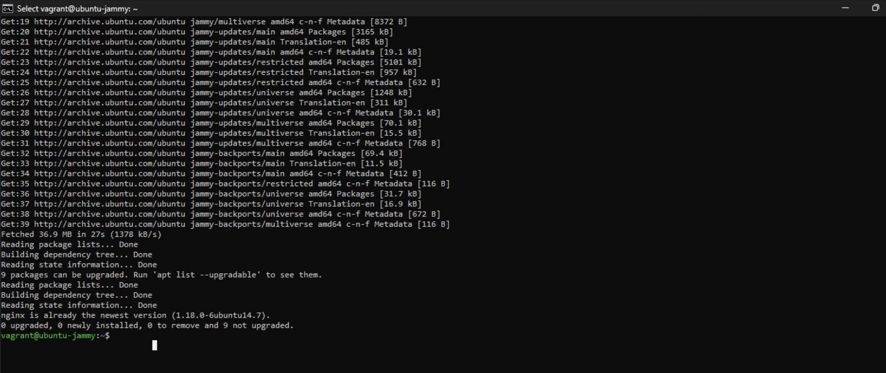

#### Step 7: Install Nginx inside VM
```bash
sudo apt update
sudo apt install nginx
sudo systemctl start nginx
```


#### Step 8: Verify Nginx in VM
```bash
curl localhost
```
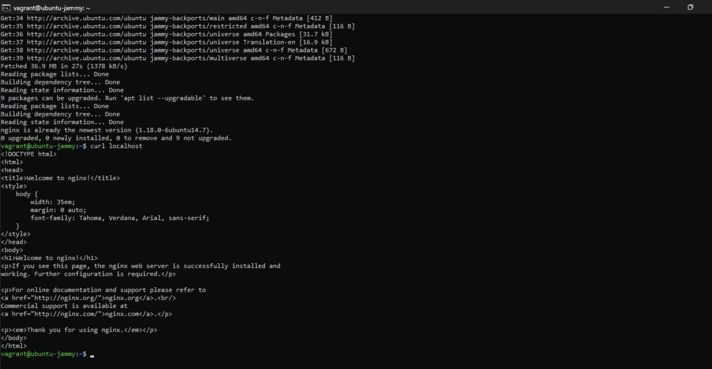

#### Step 9: Observe Resource Usage (VM)

CPU and memory usage were monitored using Task Manager while VM was running.
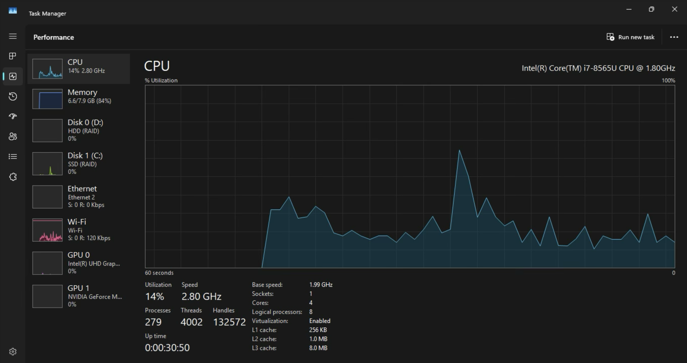


### Steps - _All the Steps are for Mac Users_

### Docker Setup

1. Install Docker Desktop for Mac,
Docker Desktop was downloaded and installed from the official Docker website.<br>
Since macOS supports Docker natively, WSL is not required.
 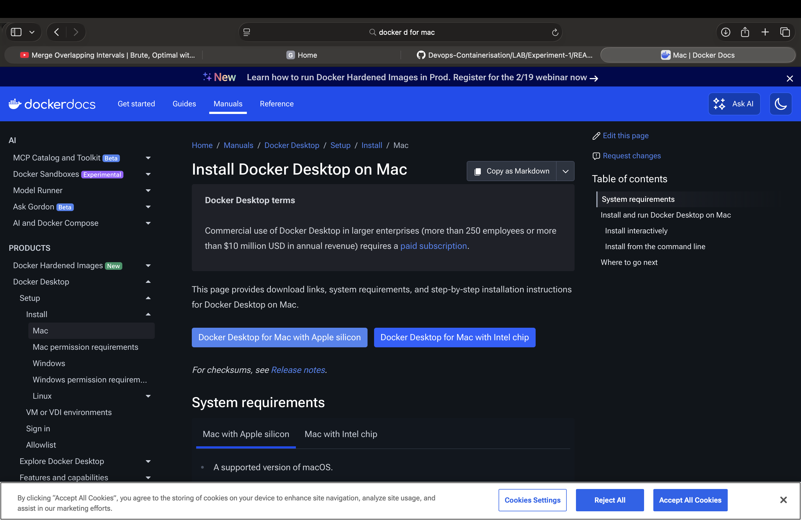
2. Open Docker Desktop Application on your Mac from selecting it from applications.

3. Verify your Docker installation by running the command `_docker --version_`<br>
You can see _Containers : 3_ in the output and also the `docker version`.
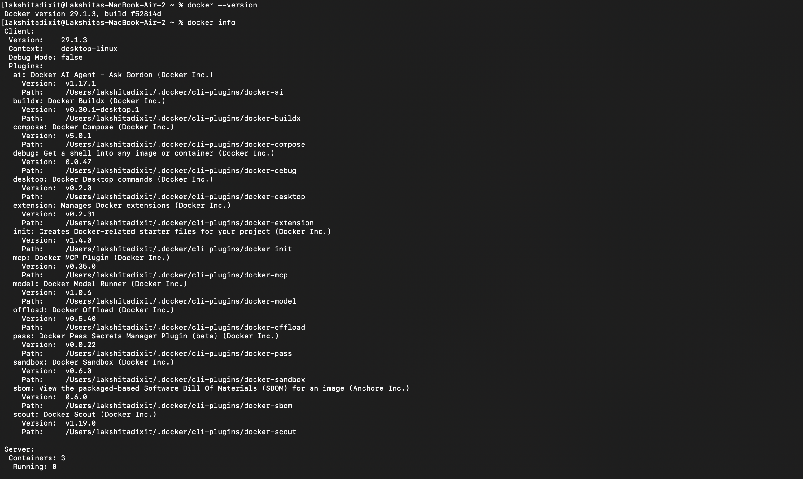

### Pull Ubuntu and Nginx Image

**UBUNTU IMAGE**

3. Command : ```bash docker pull ubuntu ```
This command tells Docker: <br>
“Download the Ubuntu image from Docker Hub to my local machine.”
- docker → Docker CLI tool
- pull → Download an image
- ubuntu → The image name<br>
Since no tag was specified, Docker uses the default tag: latest.
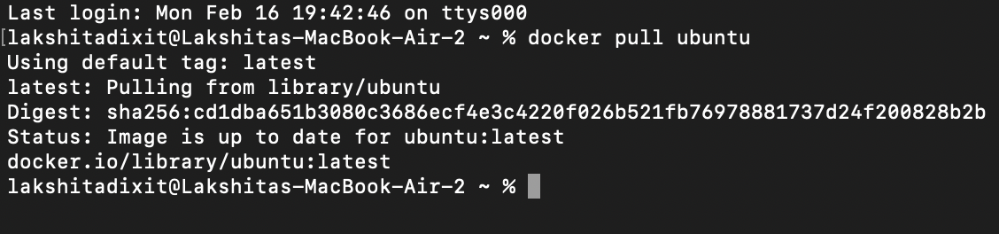


**Meaning of the OUTPUT**
`Digest: sha256:cd1dba651b3080c3686ecf4e3c4220f026b521fb76978881737d24f200828b2b`
This is a unique cryptographic hash of the image.


**NGINIX IMAGE**

4. Command : `docker pull nginx_` This downloads the official Nginx image from Docker Hub.
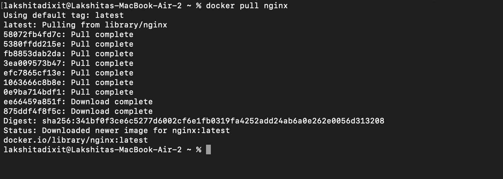

### Run Nginx Container

5. Command : `docker run -d -p 8080:80 --name nginx-container nginx`<br>
- `-d` → Run in detached mode  
- `-p 8080:80` → Map port 8080 (host) to port 80 (container)  
- `--name nginx-container` → Container name  
- `nginx` → Image name
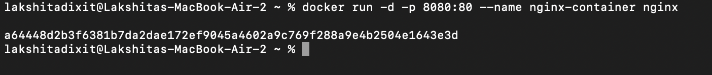

| Command              | What it does                 |
| -------------------- | ---------------------------- |
| `docker pull ubuntu` | Downloads Ubuntu image       |
| `docker images`      | Shows downloaded images      |
| `docker run ubuntu`  | Creates & starts a container |

   
### Verify Ngnix in Container 

6. Command : ```bash curl localhost:8080```
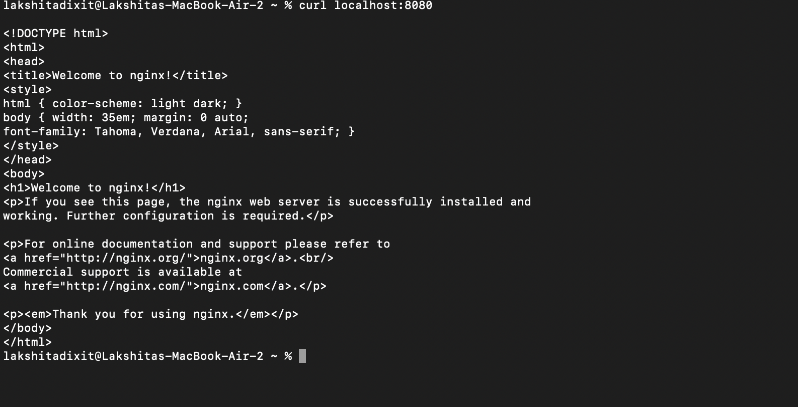

What this means : <br>

- curl : tool to request a web page from terminal
- localhost : your own computer
- 8080 : port number


- You can also verify that the Ngnix container is running through checking the docker desktop
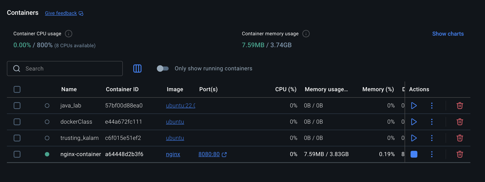


- You can also verify it by checking directly on the web page "http://localhost:8080
". <br>
This has the same output for the html code that we got earlier.
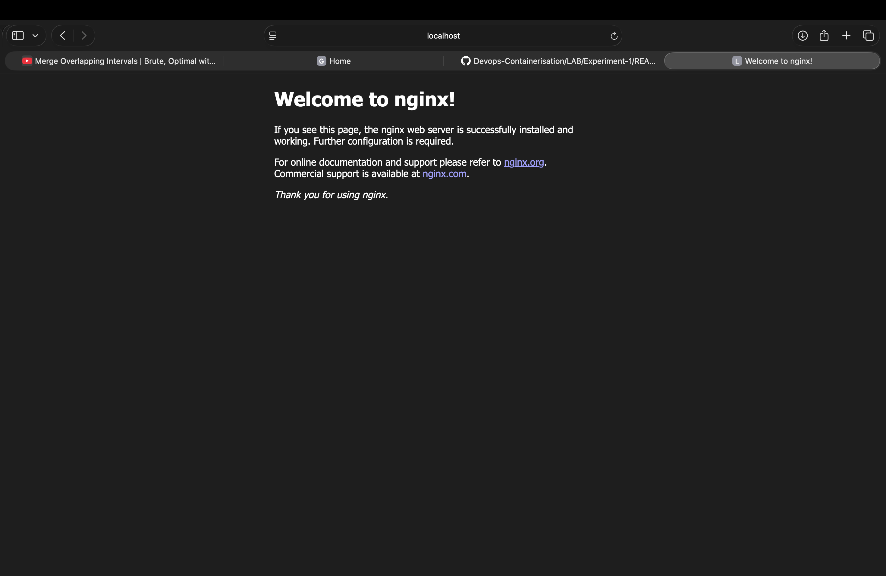

- You can also verify it using the commad `docker ps` 
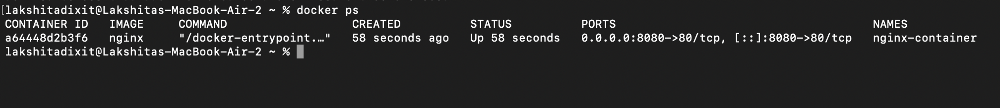


### Resource Utilisation Observation 

It was observed that the Virtual Machine consumed significantly higher CPU and memory resources because it runs a complete operating system. The Docker container started faster and consumed fewer resources while running the same Nginx service.

**Container Obeservation Command** 

- `docker stats` tells you the memory usage of each container, CPU usage, Network usage, etc. <br>
- `vm_stat` specifically for _MAC_ tells you Memory of macOS system.

```bash 
docker stats
vm_stat
```
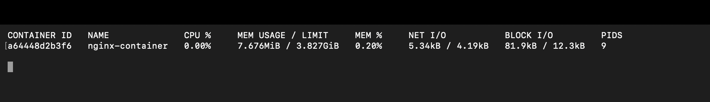
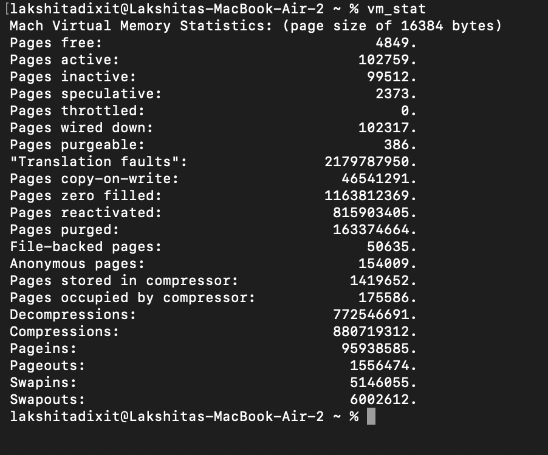


### Challenges 

1. As this is a Mac system the `free -h` did not work and had to find the mac compatible command which is `vm_stat`. 
2. Difficulty in understanding port mapping of 8080 to the nginx port 80.
3. Difficulty in performing all VM related operations.


