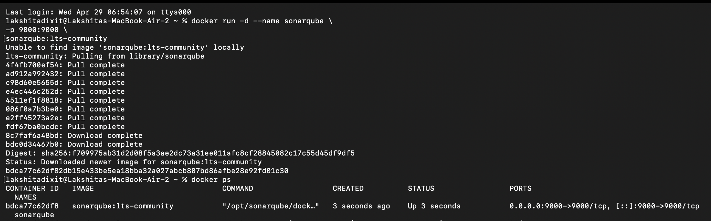
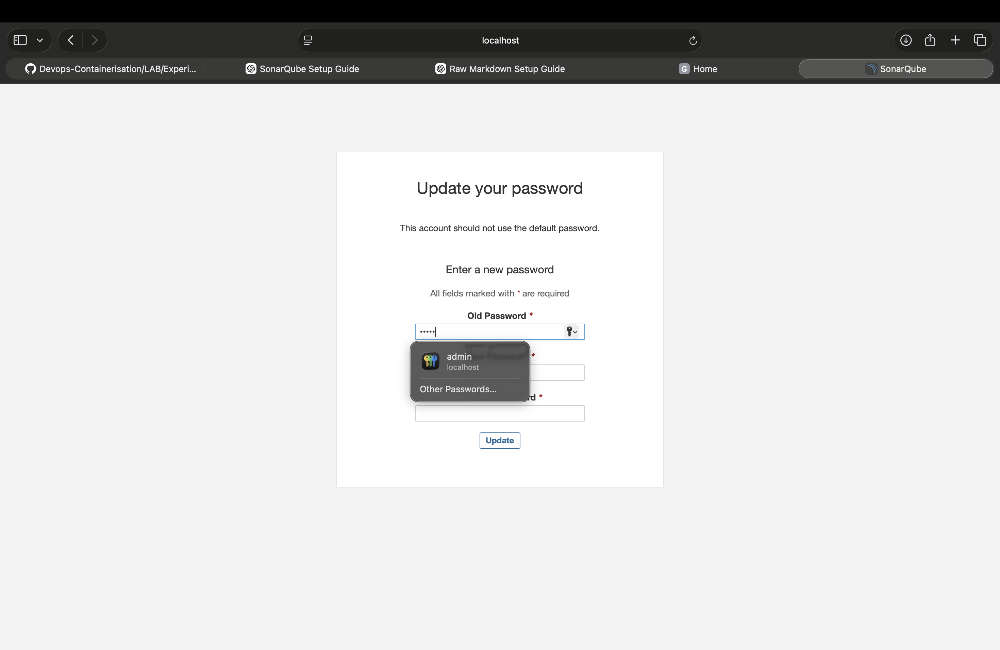
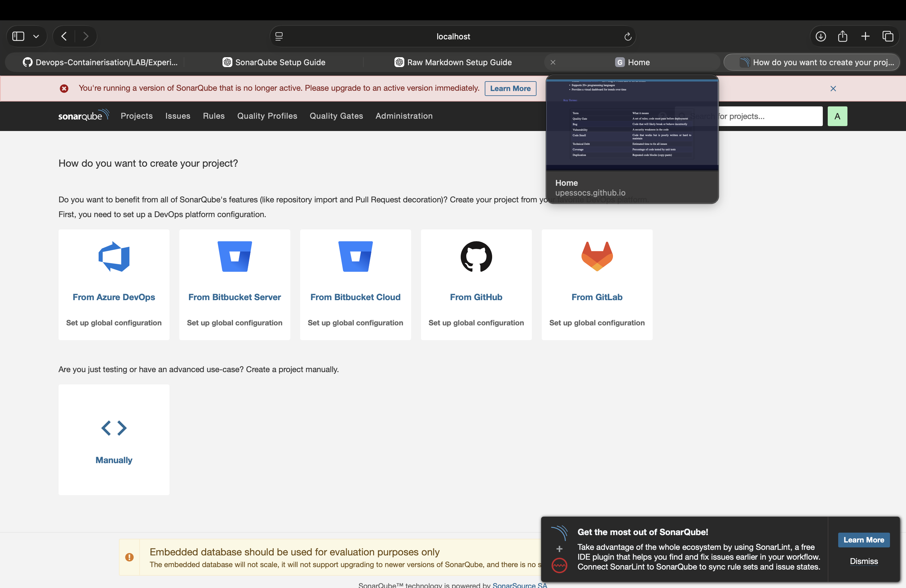
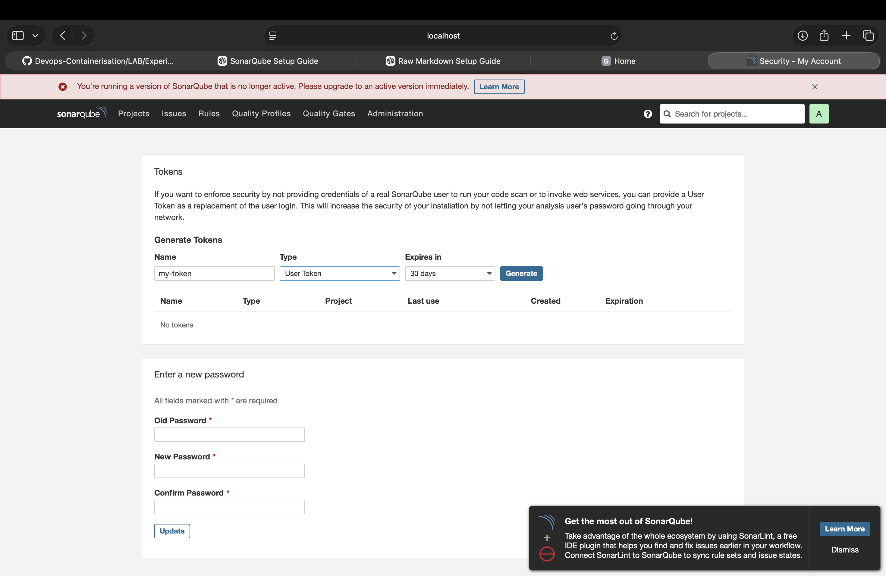
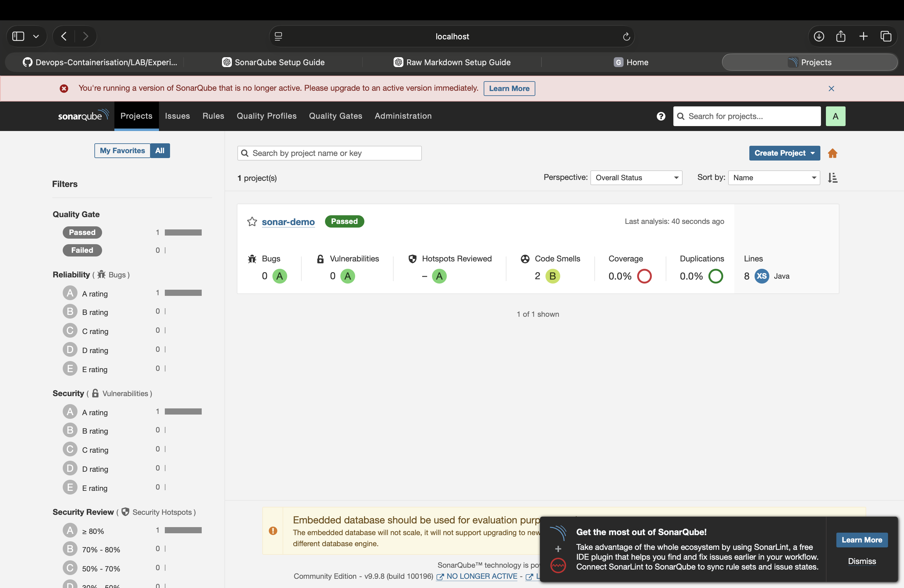
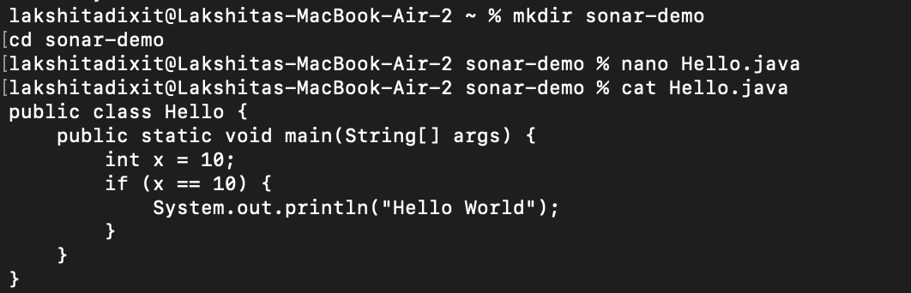
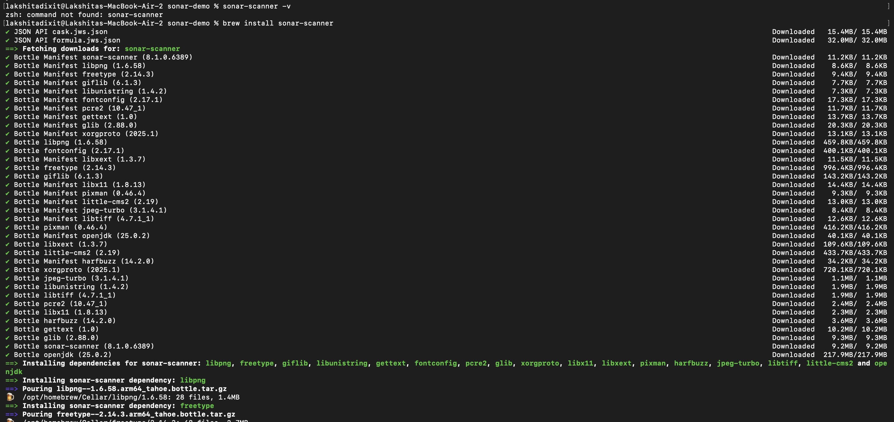
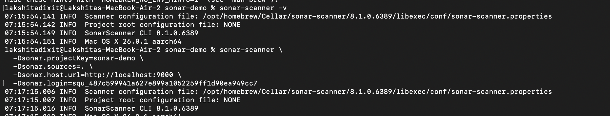
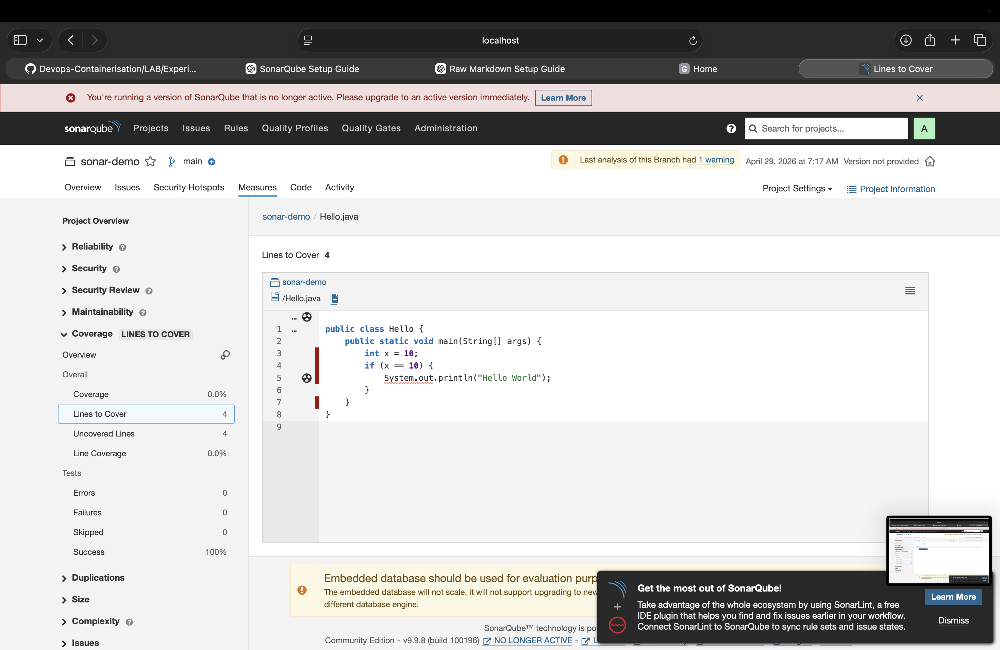

# Devops-Containerisation

## Name: Lakshita Dixit 
## SAP : 500125823

# Experiment 10: SonarQube — Static Code Analysis

## Objective

- To understand the concept of static code analysis  
- To identify bugs, vulnerabilities, and code smells using SonarQube  
- To evaluate code quality using metrics like coverage and technical debt  
- To understand the role of Quality Gates in maintaining code standards  

---

## Theory

### Problem Statement

Code bugs and security issues are often detected too late — during testing or after deployment.  
Manual code reviews are:
- Slow  
- Inconsistent  
- Difficult to scale as teams grow  

---

## What is SonarQube?

SonarQube is an open-source platform that automatically scans source code for:
- Bugs  
- Security vulnerabilities  
- Maintainability issues  

It performs **static analysis**, which means analyzing code without executing it.

---

## How SonarQube Solves the Problem

- Scans code on every commit and provides immediate feedback  
- Enforces **Quality Gates** (pass/fail conditions before deployment)  
- Tracks **Technical Debt** (time required to fix issues)  
- Supports more than 20 programming languages  
- Provides a visual dashboard to monitor code quality over time  

---

## Key Terms

| Term           | What it Means |
|----------------|--------------|
| Quality Gate   | A set of rules that code must pass before deployment |
| Bug            | Code that may break or behave incorrectly |
| Vulnerability  | A security weakness in the code |
| Code Smell     | Poorly written code that is hard to maintain |
| Technical Debt | Estimated time required to fix all issues |
| Coverage       | Percentage of code tested by unit tests |
| Duplication    | Repeated code blocks (copy-paste) |

# Step 1: Start SonarQube (Using Docker)

We will run SonarQube in a container.

---

## Run Command

```bash
docker run -d --name sonarqube \
-p 9000:9000 \
sonarqube:lts-community
```

---

## What This Does

- Downloads the SonarQube image (if not already present)  
- Runs it in the background (`-d`)  
- Exposes it on port 9000  
- Names the container `sonarqube`  

# Step 2: Open SonarQube in Browser

Now that the container is running, open the following URL in your browser:

```
http://localhost:9000
```


# Step 3: Login to SonarQube

Use the default credentials:

- Username: admin  
- Password: admin  


---

## Note

You may be prompted to change the password.
You can set a simple password for now (for example: `admin123`).


# Step 4: Generate SonarQube Token

This token allows your scanner (or Jenkins later) to communicate securely with SonarQube.

---

## Steps

- Click your profile in the top-right corner (admin)  
- Select **My Account**  
- Go to the **Security** tab  

Under **Generate Tokens**:
- Name: my-token (or any name)  
- Click **Generate**  
- User token


---

## Important

You will see a token like:
```text
sqp_xxxxxxxxxxxxx
```


Save this token immediately. You will not be able to see it again.

# Step 4: Create a Sample Project (To Scan)

We need some code to analyze.

---

## Create Project Folder

```bash
mkdir sonar-demo
cd sonar-demo
```

---

## Create a Java File

```bash
nano Hello.java
```

Paste this code:

```java
public class Hello {
    public static void main(String[] args) {
        int x = 10;
        if (x == 10) {
            System.out.println("Hello World");
        }
    }
}
```


---

## Save File

- Press CTRL + X  
- Press Y  
- Press Enter  

---

## Why This Step

- SonarQube requires source code to analyze  
- This simple file will help demonstrate code quality analysis and generate basic code smells  

# Step 5A: Install Sonar Scanner (Mac)

Since you're on Mac, install Sonar Scanner using Homebrew.

---

## Install Sonar Scanner

```bash
brew install sonar-scanner
```

Wait for the installation to complete.

---

## Verify Installation

```bash
sonar-scanner -v
```


You should see version information printed, confirming successful installation.

# Step 5B: Run Your First Scan

Now we connect your code to SonarQube.

---

## Run Scan Command

Inside your `sonar-demo` folder, run:

```bash
sonar-scanner \
  -Dsonar.projectKey=sonar-demo \
  -Dsonar.sources=. \
  -Dsonar.host.url=http://localhost:9000 \
  -Dsonar.login=YOUR_TOKEN
```

---

## Important

Replace:
```
YOUR_TOKEN
```

With the token you generated earlier.


---

## What This Does

- `sonar.projectKey` → Unique name for your project  
- `sonar.sources=.` → Scans the current folder  
- `sonar.host.url` → URL where SonarQube is running  
- `sonar.login` → Authentication using your token  

# Step 6: View Results on Dashboard

Now open your project in SonarQube.

---

## Open Dashboard

Go to:
```
http://localhost:9000
```

---

## Navigate to Project

- On the homepage, locate your project:
  - sonar-demo  
- Click on it  

---

## What You Should See

A dashboard displaying:

- Bugs  
- Vulnerabilities  
- Code Smells  
- Coverage  
- Quality Gate (PASS / FAIL)  

# Observation

After scanning the project using SonarQube, I observed code quality metrics such as warnings, code coverage, and issues. The tool highlighted a code smell in the Java file and showed 0% coverage due to absence of test cases. The Quality Gate was not fully passed, indicating improvements are needed.

# Conclusion

SonarQube successfully analyzed the project and detected code quality issues. It provides detailed insights into bugs, code smells, and coverage, helping improve overall software quality.