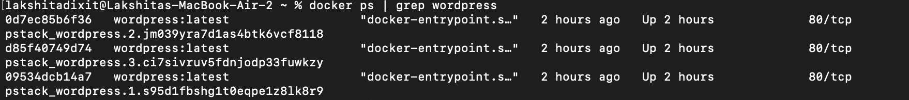
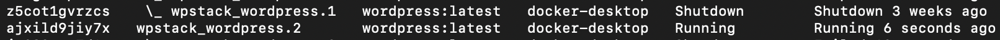

# Devops-Containerisation
### Name : Lakshita Dixit
### SAP ID : 500125823

# Experiment 11

## Title
Orchestration using Docker Compose and Docker Swarm (Continuation of Experiment 6)

---

# PART A – CONCEPT CONTINUATION (Simple Explanation)

From Experiment 6, you already know:

| Tool            | What it does                     | Limitation                          |
|-----------------|----------------------------------|-------------------------------------|
| docker run      | Runs a single container          | Manual, no coordination             |
| Docker Compose  | Runs multiple containers together| Single machine, no auto-healing     |

---

## New Concept: Orchestration

Orchestration means automatic management of containers.

Think of it like a restaurant manager:
- Decides how many waiters are needed (scaling)  
- Replaces a sick waiter immediately (self-healing)  
- Distributes customers evenly (load balancing)  

---

## What Orchestration Adds

| Feature        | What it means                                      |
|----------------|----------------------------------------------------|
| Scaling        | Increase or decrease number of containers          |
| Self-healing   | Restart failed containers automatically            |
| Load balancing | Distribute traffic across containers               |
| Multi-host     | Run containers across multiple machines            |

---

## The Progression Path

```
docker run  →  Docker Compose  →  Docker Swarm  →  Kubernetes
   │               │                  │                │
Single container  Multi-container    Orchestration    Advanced
                 (single host)       (basic)         orchestration
```

This experiment focuses on:
- Moving from Docker Compose to Docker Swarm  

---

# PART B – PRACTICAL (Extension of Experiment 6)

## Prerequisites

- Docker installed (with Swarm mode enabled)  
- The `docker-compose.yml` file from Experiment 6 (WordPress + MySQL setup)  

### Continuation of Experiment - 6
## Step 7: Stop Application

Command:

```
docker compose down
```

Result:

- Containers removed
- Network removed
- Volumes remain intact

---

# Scaling Experiment

## Scaling WordPress Service

Command:

```
docker compose up --scale wordpress=3
```

Observation:

Error due to fixed container name.

Error reason:

Docker requires unique container names for scaling.

Solution:

Remove:

```
container_name: wordpress_app
```

Then scaling works correctly.

---

# Docker Swarm Deployment

## Step 1: Initialize Swarm

Command:

```
docker swarm init
```


Observation:

Node initialized as manager.

---

## Step 2: Deploy Stack

Command:

```
docker stack deploy -c docker-compose.yml wpstack
```

Observation:

Services created:

```
wpstack_db
wpstack_wordpress
wpstack_nginx
```

---

## Step 3: Verify Services

Command:

```
docker service ls
```

Observed services:

```
wpstack_db
wpstack_nginx
wpstack_wordpress
```

---

## Step 4: Scale Service

Command:

```
docker service scale wpstack_wordpress=3
```

Observation:

```
overall progress: 3 out of 3 tasks
verify: Service converged
```

---

## Step 5: Verify Replicas

Command:

```
docker service ps wpstack_wordpress
```

Observation:

Three WordPress containers running successfully.

---

# Test Self-Healing (Automatic Recovery)

Self-healing means Docker Swarm automatically replaces failed containers to maintain the desired state.

---

## Step 1: Find a WordPress Container

```bash
docker ps | grep wordpress
```

Copy the **CONTAINER ID** of one WordPress container.
 
---

## Step 2: Kill It (Simulate a Crash)

```bash
docker kill <container-id>
```

Example:
```bash
docker kill a1b2c3d4e5f6
```


---

## Step 3: Watch Swarm Recreate It

```bash
docker service ps wpstack_wordpress
```

---

## Expected Output

```text
ID             NAME                      IMAGE              NODE     DESIRED STATE   CURRENT STATE
xxxxx          wpstack_wordpress.1       wordpress:latest   your-pc   Running         Running
yyyyy          wpstack_wordpress.2       wordpress:latest   your-pc   Running         Running
zzzzz          wpstack_wordpress.3       wordpress:latest   your-pc   Running         Running
aaaaa          _ wpstack_wordpress.3     wordpress:latest   your-pc   Shutdown        Failed 5 seconds ago
```

---

## What to Observe

- The killed container shows **Shutdown / Failed**  
- A new container is automatically created  
- Total replicas remain equal to 3  

---

## Concept Demonstrated

- Docker Swarm maintains the desired state automatically  
- Failed containers are replaced without manual intervention  
- This behavior is called **self-healing**  