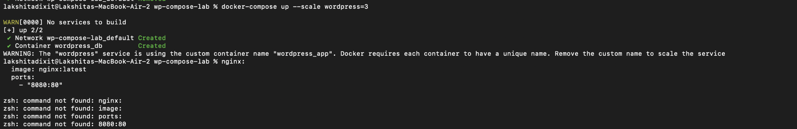
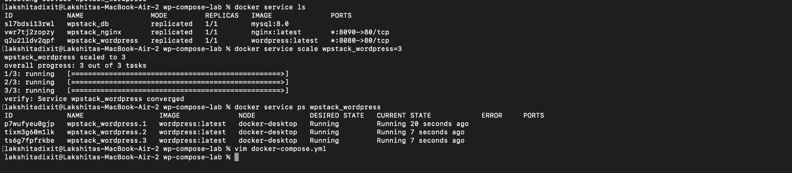
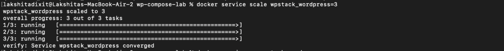
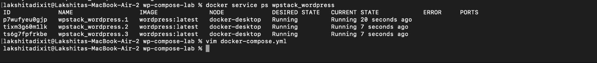

## Step 7: Stop Application

Command:

```
docker compose down
```

Result:

- Containers removed
- Network removed
- Volumes remain intact

---

# Scaling Experiment

## Scaling WordPress Service

Command:

```
docker compose up --scale wordpress=3
```

Observation:

Error due to fixed container name.

Error reason:

Docker requires unique container names for scaling.

Solution:

Remove:

```
container_name: wordpress_app
```

Then scaling works correctly.

---

# Docker Swarm Deployment

## Step 1: Initialize Swarm

Command:

```
docker swarm init
```


Observation:

Node initialized as manager.

---

## Step 2: Deploy Stack

Command:

```
docker stack deploy -c docker-compose.yml wpstack
```

Observation:

Services created:

```
wpstack_db
wpstack_wordpress
wpstack_nginx
```

---

## Step 3: Verify Services

Command:

```
docker service ls
```

Observed services:

```
wpstack_db
wpstack_nginx
wpstack_wordpress
```

---

## Step 4: Scale Service

Command:

```
docker service scale wpstack_wordpress=3
```

Observation:

```
overall progress: 3 out of 3 tasks
verify: Service converged
```

---

## Step 5: Verify Replicas

Command:

```
docker service ps wpstack_wordpress
```

Observation:

Three WordPress containers running successfully.

---
