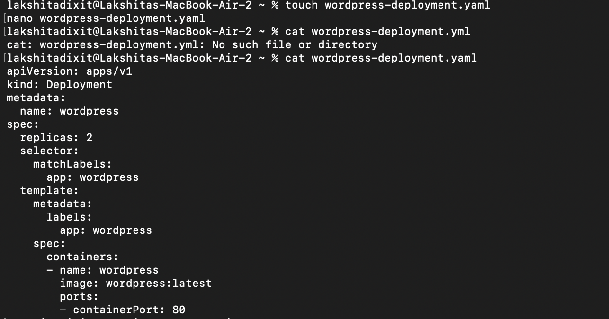
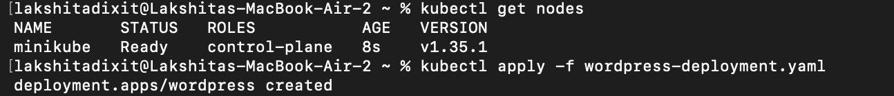
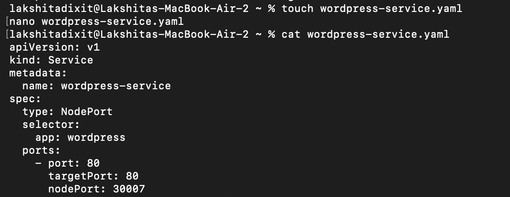
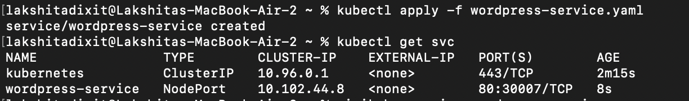
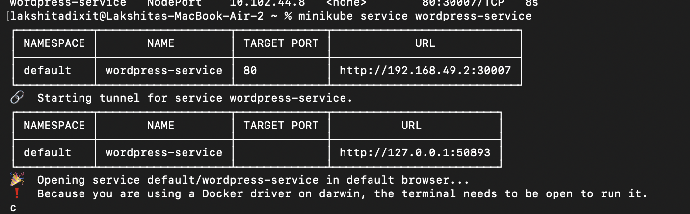
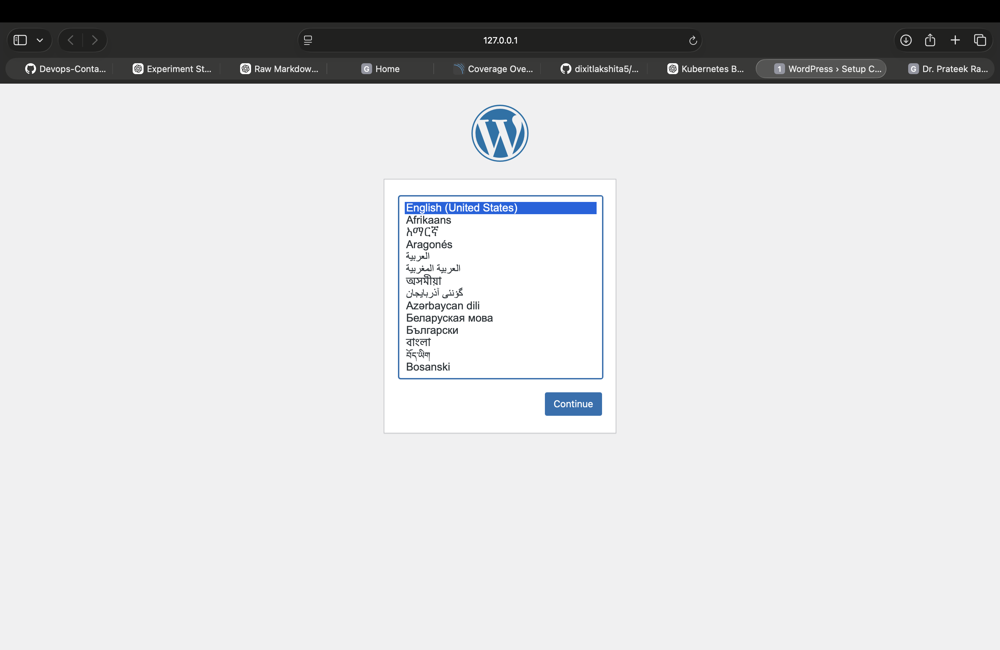
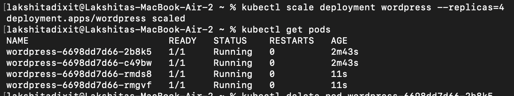
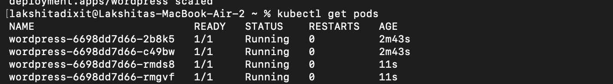
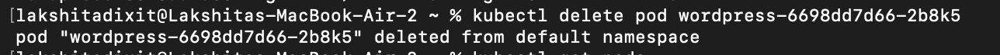
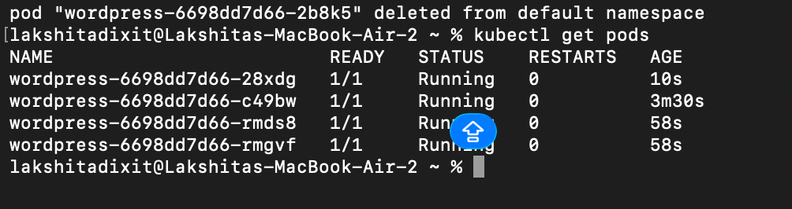

# Experiment 12: Study and Analyse Container Orchestration using Kubernetes

---

## Objective

The objective of this experiment is to understand container orchestration using Kubernetes by deploying an application using a Deployment and Service, and to learn how Kubernetes manages scaling and ensures application reliability through self-healing.

---

## Theory

Kubernetes is an open-source container orchestration platform used to automate the deployment, scaling, and management of containerized applications.

### Why Kubernetes over Docker Swarm?

- Industry standard used by most companies  
- Advanced scheduling capabilities  
- Large ecosystem with many tools  
- Supports cloud platforms like AWS, Azure, and Google Cloud  

---

## 🔑 Core Concepts

| Docker Concept | Kubernetes Equivalent | Description |
|--------------|----------------------|------------|
| Container     | Pod                  | Smallest unit, contains one or more containers |
| Service       | Deployment           | Defines how an application runs |
| Load balancing| Service              | Exposes application to external traffic |
| Scaling       | ReplicaSet           | Maintains desired number of pods |

---

## ⚙️ Procedure

### Step 1: Create Deployment File

Create a file named `wordpress-deployment.yaml`:

```yaml
apiVersion: apps/v1
kind: Deployment
metadata:
  name: wordpress
spec:
  replicas: 2
  selector:
    matchLabels:
      app: wordpress
  template:
    metadata:
      labels:
        app: wordpress
    spec:
      containers:
      - name: wordpress
        image: wordpress:latest
        ports:
        - containerPort: 80
```


### STEP 2 : Apply deployment 



### STEP 3 Verify Pods

Now check if your WordPress pods are running.

---

## Run Command

```bash
kubectl get pods
```

---

## What This Means

- Each pod represents one instance of your application  
- STATUS = Running indicates the pods are working correctly  
- If you created 2 replicas, you should see 2 pods  

# Step 4: Create the Service (Access WordPress)

Your pods are running, but they are not accessible in the browser yet.  
We need to expose them using a Kubernetes Service.

---

## Create Service File

```bash
touch wordpress-service.yaml
nano wordpress-service.yaml
```
---

## Add Configuration

Paste the following:

```yaml
apiVersion: v1
kind: Service
metadata:
  name: wordpress-service
spec:
  type: NodePort
  selector:
    app: wordpress
  ports:
    - port: 80
      targetPort: 80
      nodePort: 30007
```



# Step 5: Apply and Verify the Service

---

## Apply the Service

```bash
kubectl apply -f wordpress-service.yaml
```

Expected output:
```text
service/wordpress-service created
```

---

## Verify the Service

```bash
kubectl get svc
```


---

## What This Means

- The service is successfully created  
- Port 30007 is exposed externally  
- You can now access WordPress via the node IP and port  

# Step 6: Open WordPress in Browser

Since we are using Minikube, the easiest way is:

---

## Run Command

```bash
minikube service wordpress-service
```


---

## What This Does

- Automatically opens your browser  
- Loads your WordPress site  

---

# Step 7: Scale the Deployment

Now we increase the number of pods from 2 to 4 to demonstrate scalability.

---

## Scale the Deployment

```bash
kubectl scale deployment wordpress --replicas=4
```

---

## Verify Scaling

```bash
kubectl get pods
```


---

## What This Means

- Kubernetes created additional pods automatically  
- The application is now handling more load  
- Demonstrates horizontal scaling  

# STEP 8 : Self-Healing Demo (Final Step)

Kubernetes automatically replaces failed pods to maintain the desired state.

---

## Step 1: List Pods

```bash
kubectl get pods
```

---

## Step 2: Delete Any One Pod

```bash
kubectl delete pod <pod-name>
```


Example:
```bash
kubectl delete pod wordpress-abcde-12345
```

---

## Step 3: Check Again

```bash
kubectl get pods
```


---

## Observation

- The deleted pod will terminate  
- A new pod will be created automatically  
- Total number of pods remains the same  

---

## What This Demonstrates

- Kubernetes maintains the desired state  
- Failed pods are automatically recreated  
- This behavior is called **self-healing**  

# Conclusion

- The experiment demonstrated deployment of a containerized application using Kubernetes  
- It showed how a Deployment manages multiple replicas of an application  
- The Service successfully exposed the application for external access  
- Scaling was achieved by dynamically increasing the number of pods  
- Kubernetes ensured reliability through self-healing by automatically recreating deleted pods  
- Overall, Kubernetes proved to be an efficient tool for managing scalable and highly available applications  