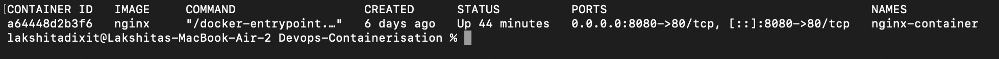
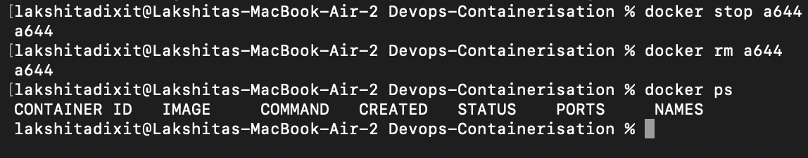
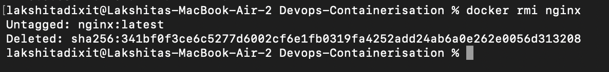

# Devops-Containerisation

Name: Lakshita Dixit  
School of Computer Science  
University of Petroleum and Energy Studies, Dehradun  

---

## EXPERIMENT – 2  
## Docker Installation, Configuration, and Running Images

---

## Aim

To install and configure Docker, pull Docker images, run containers, and manage the container lifecycle using Docker commands.

---

## Objectives

- To pull Docker images from Docker Hub  
- To run containers with port mapping  
- To verify running containers  
- To manage container lifecycle (start, stop, remove)

---

## Theory

Docker is an open-source containerization platform that allows applications to be packaged along with their dependencies into lightweight and portable containers.

A **Docker Image** is a read-only template used to create containers.  
A **Docker Container** is a running instance of a Docker image.

Docker follows a **client–server architecture**, where:
- The Docker Client sends commands  
- The Docker Daemon executes those commands  
- Docker Hub stores public images  

Containers are lightweight because they share the host operating system kernel, unlike traditional Virtual Machines which require a separate operating system.

---

## Software Requirements

- macOS / Windows OS  
- Docker Desktop installed and running  
- Internet connection  

---

## Procedure / Steps to Perform the Experiment


### 1. Pull Image

```bash 
docker pull nginx
```


### 2. Run Container with port mapping

```bash 
docker run -d -p 8080:80 nginx
```


### 3. Verify Running Containers 

```bash 
docker ps
```


- So our container id from here is : _*a64448d2b3f6*_.
- We can use the first four initials to operate through container id.

### 4. Stop and Remove Container id

```bash 
docker stop <container_id>
docker rm <container_id>
```



- We can verify it by `docker ps` and there will be no list of running containers as showed in the screenshot above.

### 5. Remove Image
```bash
docker rmi nginx
```



