# Devops-Containerisation

Name: Lakshita Dixit 
SAP : 500125823
School of Computer Science  
University of Petroleum and Energy Studies, Dehradun  

---

## EXPERIMENT – 4

## Dockerfile, .dockerignore, Tagging & Publishing
---

## Aim

To containerize applications using Docker, create and use Dockerfile and .dockerignore, build and tag Docker images, run containers, and publish images to Docker Hub.

---

## Objectives

- To understand the basic concepts of Docker and containerization.
- To create and use a Dockerfile to containerize a Python/Node.js application.
- To implement and understand the importance of the `.dockerignore` file.
- To build, tag, and manage Docker images and containers using Docker CLI commands.
- To publish Docker images to Docker Hub and understand the Docker development workflow.

---
## PART 1 : Containerizing a Python Flask Application Using Dockerfile

### REQUIREMENTS 

- macOS system
- Docker Desktop installed
- Terminal
- Internet connection

### THEORY

Docker is a containerization platform used to package applications with their dependencies.  

A Dockerfile is a text file containing instructions to build a Docker image.  

A Docker Image is a blueprint of the application.  

A Container is a running instance of the image.

### Step 1: Create Project Directory

- Open Terminal.

- Run the following commands:

```bash
mkdir my-flask-app
cd my-flask-app
```
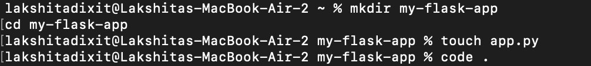
### Step 2: Create Python Flask Application( _Make sure flask is installed_)

- Create a new file:

```bash
touch app.py
```
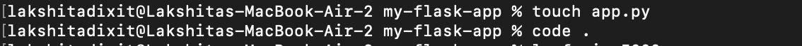
- Open it using VS Code (if installed):

```bash
code .
```
- Now paste the following code inside app.py:

```python
from flask import Flask
app = Flask(__name__)

@app.route('/')
def hello():
    return "Hello from Docker!"

@app.route('/health')
def health():
    return "OK"

if __name__ == '__main__':
    app.run(host='0.0.0.0', port=5001)
```
- We are using port 5001 instead of 5000 because the port 5000 was already in use.
- This is a mac based system, hence port 5000 is usually reserved/ used for Apple Airplay.
- We are runnung this directly from our local host.

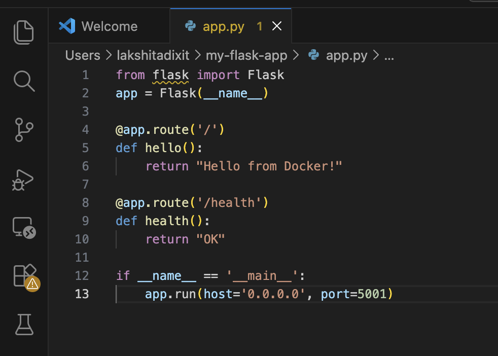
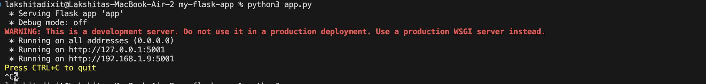

### Step 3: Create requirements.txt File

- This file contains project dependencies.

- Run:

```bash
touch requirements.txt
```


- Open it and add:

```text
Flask==2.3.3
```

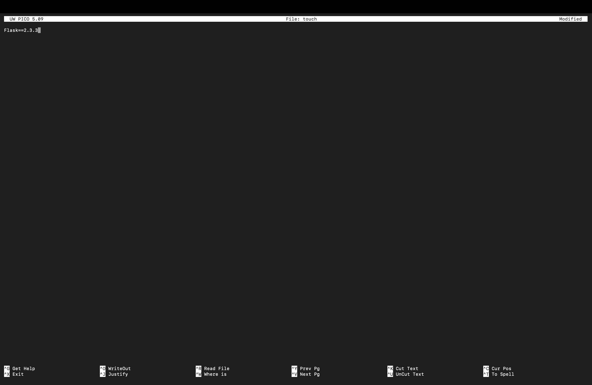

- Why requirements.txt?

  - It tells Docker which Python libraries need to be installed.

### Step 4: Create Dockerfile

- Create Dockerfile (no extension):

```bash
touch Dockerfile
```

- Now paste this inside Dockerfile:

```dockerfile
# Use Python base image
FROM python:3.9-slim

# Set working directory
WORKDIR /app

# Copy requirements file
COPY requirements.txt .

# Install dependencies
RUN pip install --no-cache-dir -r requirements.txt

# Copy application code
COPY app.py .

# Expose port
EXPOSE 5000

# Run the application
CMD ["python", "app.py"]
```
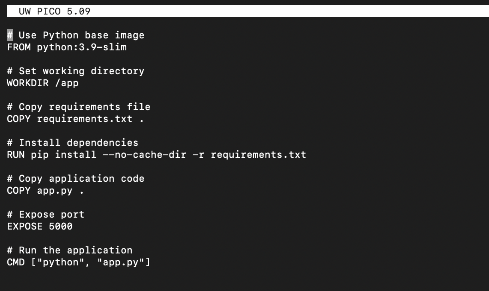

### Step 5: Build Docker Image

- Now build the image:

```bash
docker build -t my-flask-app .
```
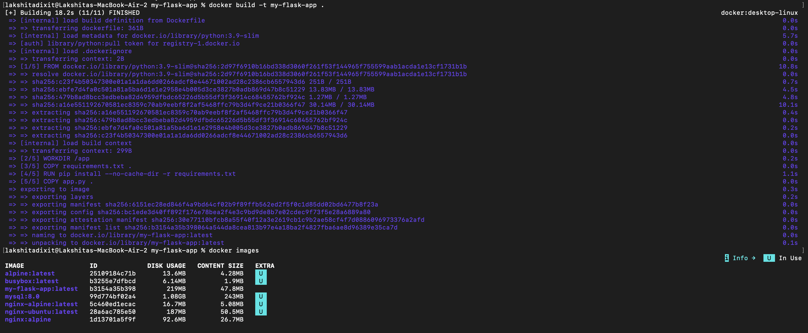
- Explanation:

  - docker build → builds the Docker image.
  - -t my-flask-app → assigns the name `my-flask-app` to the image.
  - . → indicates the current directory contains the Dockerfile.

- Wait until the build completes successfully.

### Step 6: Verify Image

- Run:

```bash
docker images
```

- You should see:

```text
my-flask-app   latest
```
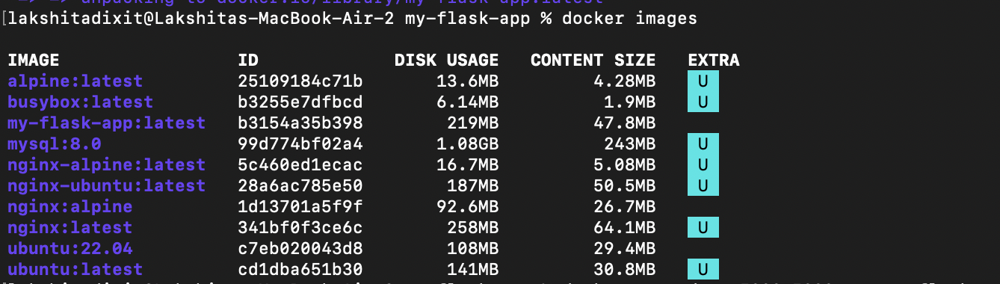

### Step 7: Run the Container

- Run:

```bash
docker run -d -p 5001:5000 --name flask-container my-flask-app
```
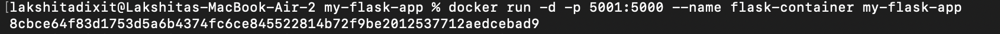
- Explanation:

  - -d → runs the container in the background (detached mode).
  - -p 5000:5000 → maps container port 5000 to Mac port 5000.
  - --name → assigns the name `flask-container` to the container.
  - my-flask-app → specifies the Docker image to run.

### Step 8: Test Application

- Open browser and type:

```text
http://localhost:5001
```
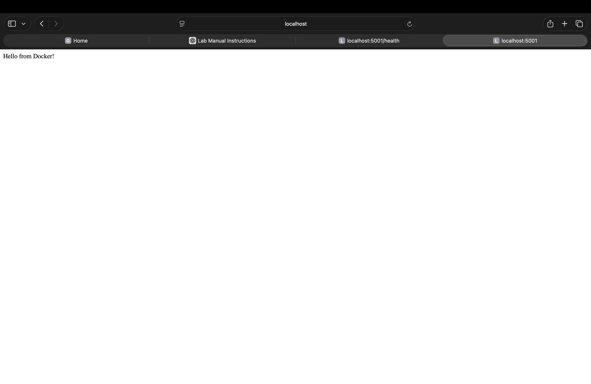

- Output:

```text
Hello from Docker!
```


- Check health endpoint:

```text
http://localhost:5001/health
```
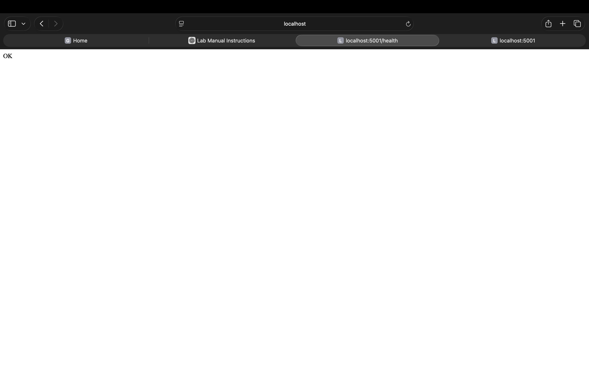
- Output:

```text
OK
```

### Step 9: Stop Container (After Testing)

```bash
docker stop flask-container
docker rm flask-container
```
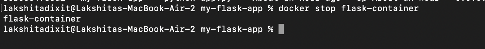

- Here as we stopped the container, we can no longer access it.

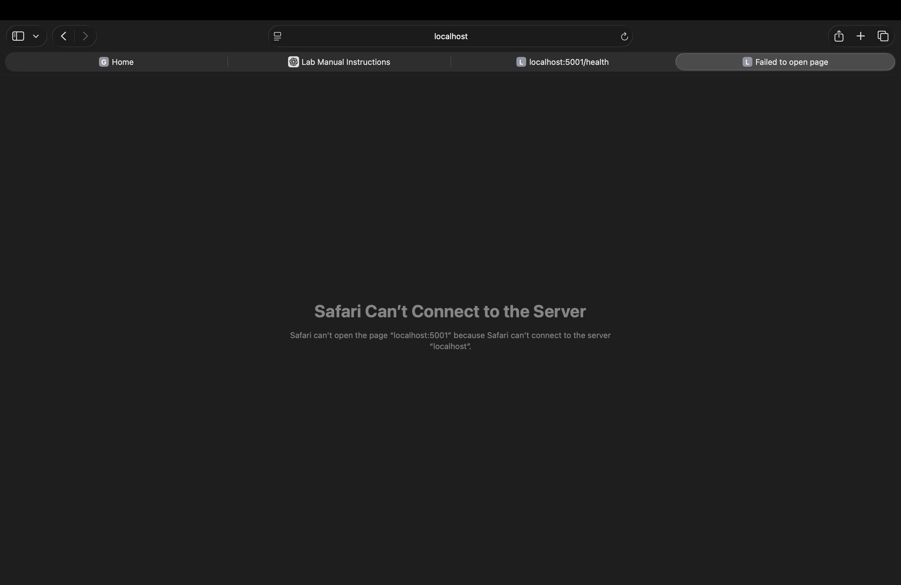

## OUTPUT

The Flask application was successfully containerized and executed inside a Docker container.

## RESULT

The simple Python Flask application was successfully containerized using Dockerfile and executed on localhost.

## Challenges Faced


1. The `python` command was not recognized on macOS.  
   - Error: `zsh: command not found: python`  
   - Reason: macOS uses `python3` instead of `python`.  
   - Solution: Used `python3 app.py`.
   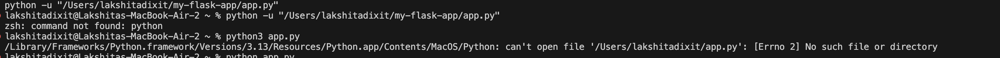

2. Flask module not found error.  
   - Error: `ModuleNotFoundError: No module named 'flask'`  
   - Reason: Flask was not installed in the Python environment.  
   - Solution: Installed Flask using `python3 -m pip install flask`.
   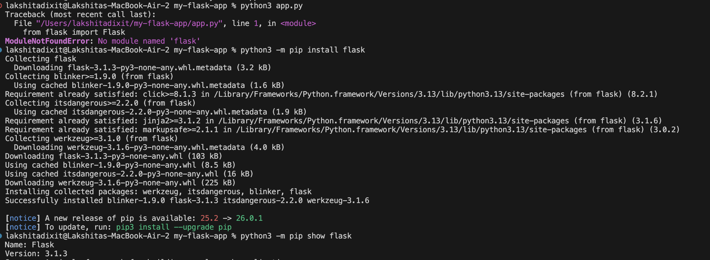

3. Port already in use error.  
   - Error: `Address already in use (Port 5000)`  
   - Reason: Port 5000 was being used by macOS Control Center / AirPlay service.  
   - Solution: Changed the application port from 5000 to 5001.
   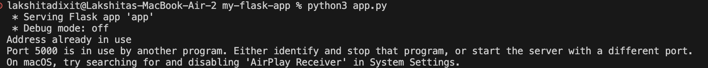
   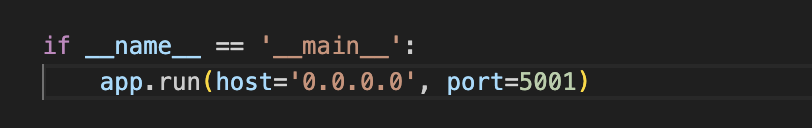
   


4. Error running container due to unavailable ports.
   - Error response from daemon: ports are not available
   - Because as before 5000 is not available.
   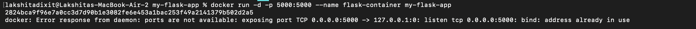


## PART 2 : Using dockerignore

### Step 1: Create .dockerignore file

- Inside your project folder (my-flask-app), create a file:

```bash
touch .dockerignore
```
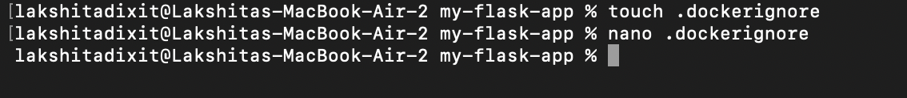

- Now open it and paste this:

```text
# Python files
__pycache__/
*.pyc
*.pyo
*.pyd

# Environment files
.env
.venv
env/
venv/

# IDE files
.vscode/
.idea/

# Git files
.git/
.gitignore

# OS files
.DS_Store
Thumbs.db

# Logs
*.log
logs/

# Test files
tests/
test_*.py
```

- Save it.

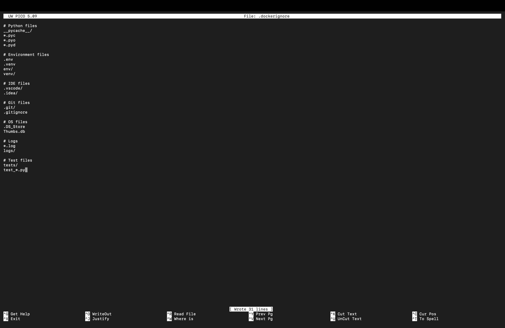

## Conclusion

  - The .dockerignore file prevents unnecessary and sensitive files from being included in the Docker image.
  - It improves build performance, reduces image size, and enhances security.


## PART 3 : Building Docker Images

### Step 1 : - Basic Build Command

- Already made in part 1 and part 2 

  - Dockerfile
  - app.py
  - requirements.txt
  - .dockerignore

### Step 2 : Check for image 

- We already have image made in the Part 1
- RUN `docker images`


## Step 3: Tagging Images


- 1. Build with Version

```bash
docker build -t my-flask-app:1.0 .
```
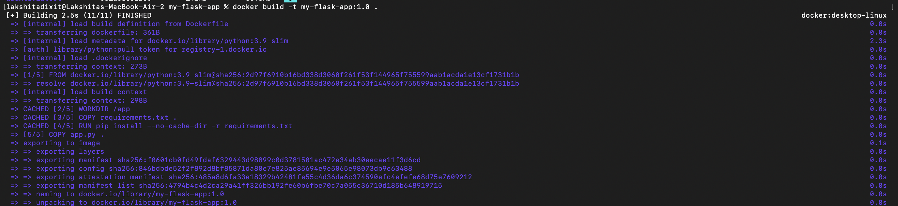

- Now image is:

```text
my-flask-app:1.0
```

- 2. Multiple Tags

```bash
docker build -t my-flask-app:latest -t my-flask-app:1.0 .
```
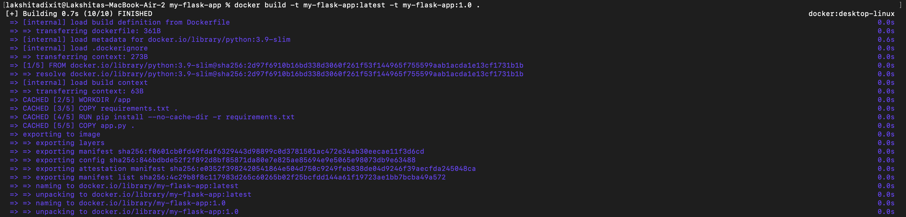

- One image → two tags.

- 3. Tag for Docker Hub

- Docker Hub format:

```text
username/image-name:tag
```

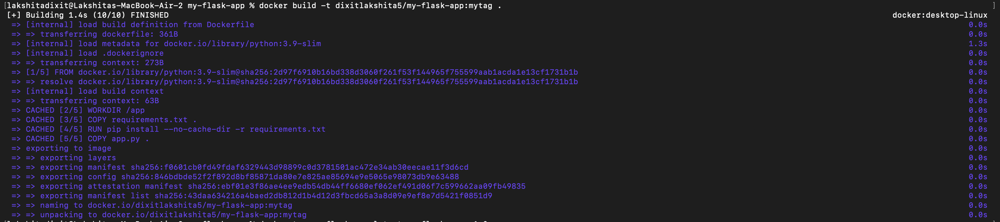
- Example:

```bash
docker build -t lakshita/my-flask-app:1.0 .
```

 
### Step 3: Viewing Image Details

- 1. List Images

```bash
docker images
```
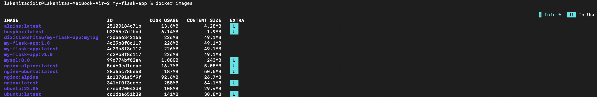

- Shows:

  - Repository
  - Tag
  - Image ID
  - Created time
  - Size

- 2. Show Image History

```bash
docker history my-flask-app
```
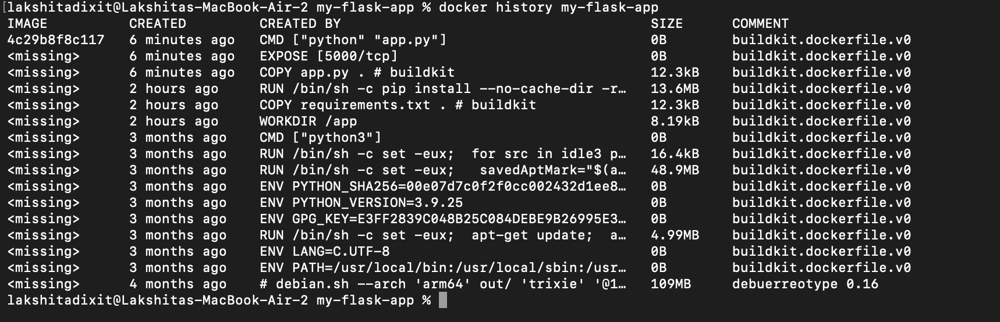

- Shows all layers created from Dockerfile instructions.

- Example:

```text
CMD python app.py
EXPOSE 5000
COPY app.py
RUN pip install
COPY requirements.txt
FROM python:3.9-slim
```

- Each Dockerfile line = one layer.

- 3. - Inspect Image (Advanced)

```bash
docker inspect my-flask-app
```
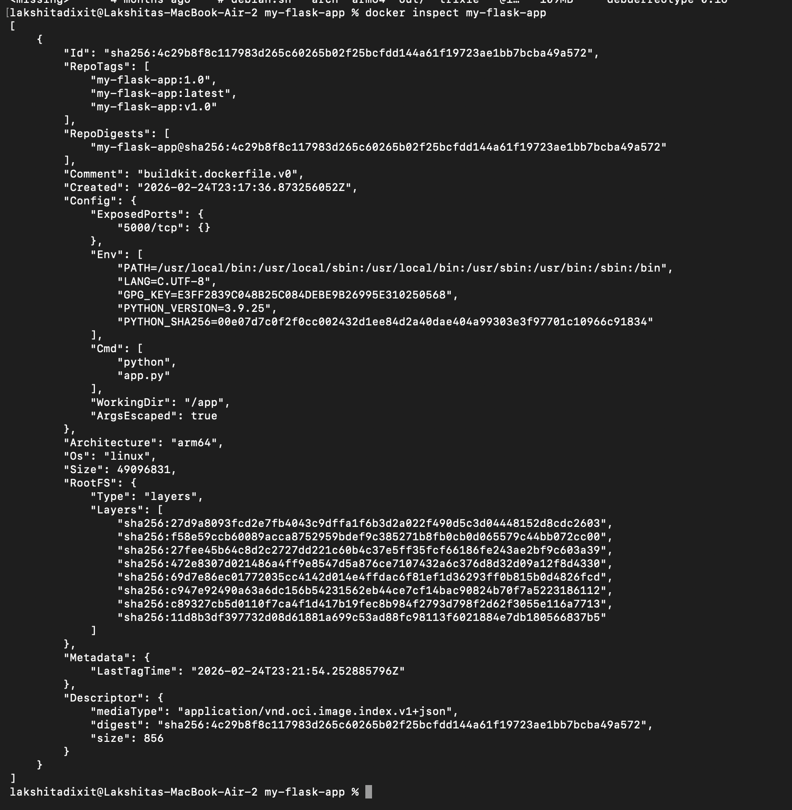
- Shows:

  - Metadata
  - Environment variables
  - Ports
  - Working directory
  - Entry point

- Very detailed JSON output.

## Part 4: Running Containers

### Step 1: Run Container

```bash
# Run container with port mapping
docker run -d -p 5001:5000 --name flask-container my-flask-app


# Test the application
curl http://localhost:5000

# View running containers
docker ps

# View container logs
docker logs flask-container
```
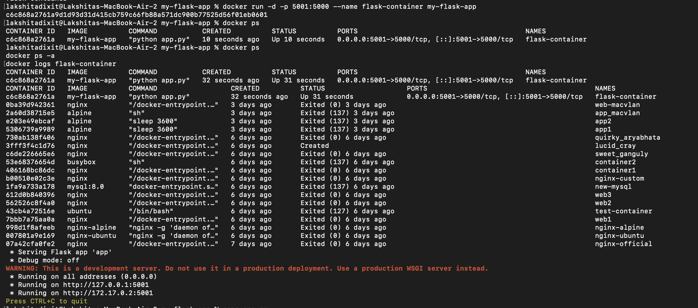


## Step 2: Manage Containers

```bash
# Stop container
docker stop flask-container

# Start stopped container
docker start flask-container

# Remove container
docker rm flask-container

# Remove container forcefully
docker rm -f flask-container
```
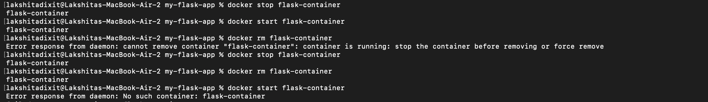

## PART 5 : Multi-stage Builds

### Step 1: What is Multi-Stage Build?

  - Multi-stage build means using multiple FROM statements in one Dockerfile.
  - It allows you to:
    - Build the application in one stage.
    - Copy only required files to the final stage.
    - Discard unnecessary tools.
  - Result → Smaller and more secure image.

- Problem with Normal Build

- Your current Dockerfile:

```dockerfile
FROM python:3.9-slim
WORKDIR /app
COPY requirements.txt .
RUN pip install -r requirements.txt
COPY app.py .
EXPOSE 5000
CMD ["python", "app.py"]
```

- Problem:

  - Build tools remain in the final image.
  - Image size is bigger.
  - Runs as root user (less secure).

### Step 2 : Multi-Stage Solution

- Create new file:

```bash
touch Dockerfile.multistage
```

- Now paste this:

```dockerfile
# ---------- STAGE 1: Builder ----------
FROM python:3.9-slim AS builder

WORKDIR /app

# Copy requirements
COPY requirements.txt .

# Create virtual environment
RUN python -m venv /opt/venv

# Activate venv
ENV PATH="/opt/venv/bin:$PATH"

# Install dependencies
RUN pip install --no-cache-dir -r requirements.txt


# ---------- STAGE 2: Runtime ----------
FROM python:3.9-slim

WORKDIR /app

# Copy only virtual environment from builder
COPY --from=builder /opt/venv /opt/venv

ENV PATH="/opt/venv/bin:$PATH"

# Copy application code
COPY app.py .

# Create non-root user
RUN useradd -m -u 1000 appuser
USER appuser

EXPOSE 5000

CMD ["python", "app.py"]
```


## Step 3: Build and Compare

```bash
# Build regular image
docker build -t flask-regular .

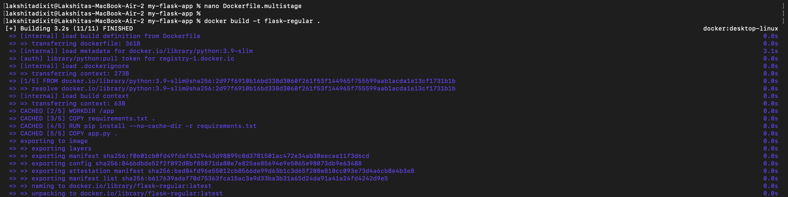

# Build multi-stage image
docker build -f Dockerfile.multistage -t flask-multistage .

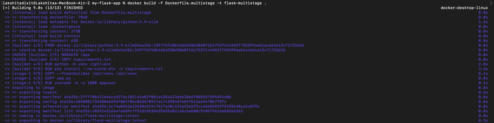


# Compare sizes
docker images | grep flask-
```
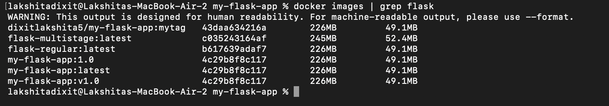

- Expected output:

```text
flask-regular     ~250MB
flask-multistage  ~150MB (40% smaller!)
```

- BUT in this case multistage is slightly larger 
| Image Name       | Size      |
| ---------------- | --------- |
| flask-regular    | **226MB** |
| flask-multistage | **245MB** |

**WHY?**
- Still using python:3.9-slim in both stages.
- A virtual environment (venv) is created inside the container.
- That venv itself adds extra size.
- So instead of reducing size, it slightly increased it.

## Observation – Part 5 (Multi-stage Build)

- After building both images and comparing sizes:

```text
flask-regular:latest     226MB
flask-multistage:latest  245MB
```

- It was observed that the multi-stage image was slightly larger than the regular image in this experiment.

- This is because:

  - The same base image was used in both stages.
  - A virtual environment was created, which increased the size.
  - No heavy build tools were removed.

- However, multi-stage builds are generally useful in large applications where build dependencies can be excluded from the final runtime image.