## NAME : Lakshita Dixit
## SAP ID : 500125823

# Experiment 5: Docker Volumes, Environment Variables, Monitoring and Networks

## Aim

To study Docker volumes for persistent storage, environment variables for container configuration, monitoring tools for container performance and Docker networks for communication between containers.

## Objectives

- To understand Docker volumes
- To learn environment variables in Docker
- To monitor Docker containers
- To understand Docker networking
- To implement multi-container applications

## Requirements

- Docker installed
- Terminal access
- Internet connection

## Procedure

### Part 2: Volume Types

#### Anonymous Volume

docker run -d -v /app/data --name web1 nginx

docker volume ls

docker inspect web1
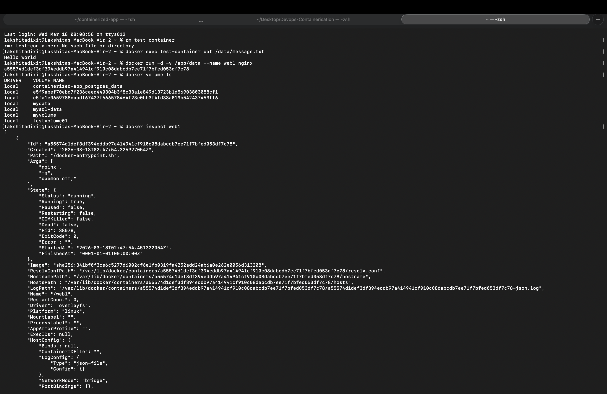

---

#### Named Volume

docker volume create mydata

docker run -d -v mydata:/app/data --name web2 nginx

docker volume ls

docker volume inspect mydata

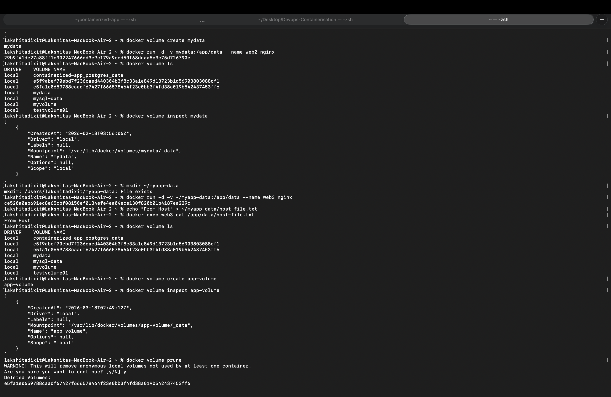

---

#### Bind Mount

mkdir ~/myapp-data

docker run -d -v ~/myapp-data:/app/data --name web3 nginx

echo "From Host" > ~/myapp-data/host-file.txt

docker exec web3 cat /app/data/host-file.txt

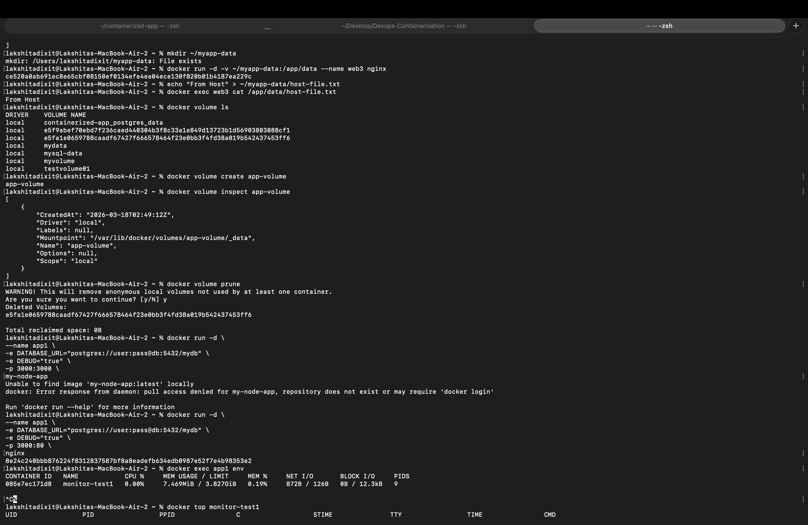
---

### Part 3: Volume Management

docker volume ls

docker volume create app-volume

docker volume inspect app-volume

docker volume prune
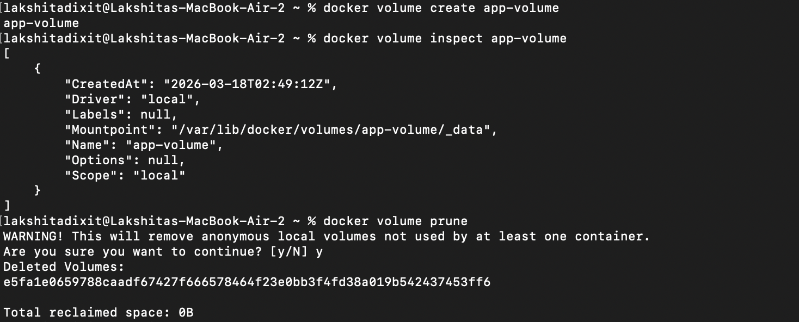

---

### Part 4: Environment Variables

#### Using -e flag

docker run -d \
--name app1 \
-e DATABASE_URL="postgres://user:pass@db:5432/mydb" \
-e DEBUG="true" \
-p 3000:80 \
nginx

docker exec app1 env

docker exec app1 printenv DATABASE_URL

docker exec app1 printenv DEBUG

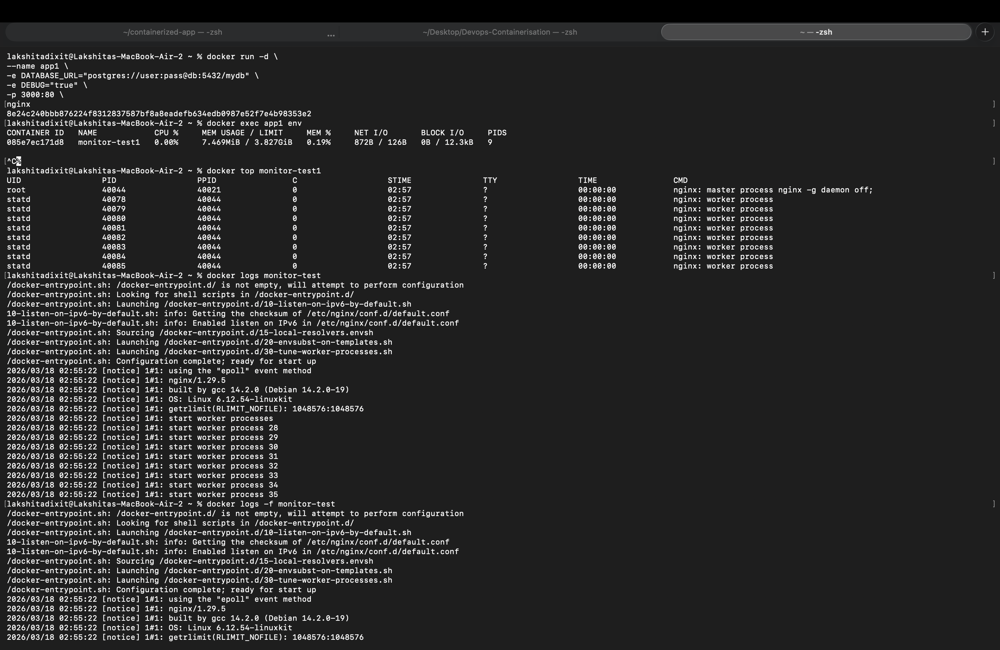
---

#### Using .env file

echo "DATABASE_HOST=localhost" > .env

echo "DATABASE_PORT=5432" >> .env

echo "API_KEY=secret123" >> .env

cat .env

docker run -d \
--name app2 \
--env-file .env \
nginx

docker exec app2 env

docker exec app2 printenv DATABASE_HOST

---

### Part 5: Docker Monitoring

docker run -d --name monitor-test nginx

docker ps

docker stats

docker stats --no-stream

docker stats monitor-test

docker top monitor-test

docker logs monitor-test

docker logs -f monitor-test

docker logs --tail 50 monitor-test

docker inspect monitor-test

docker inspect --format='{{.State.Status}}' monitor-test

docker inspect --format='{{.NetworkSettings.IPAddress}}' monitor-test

docker events

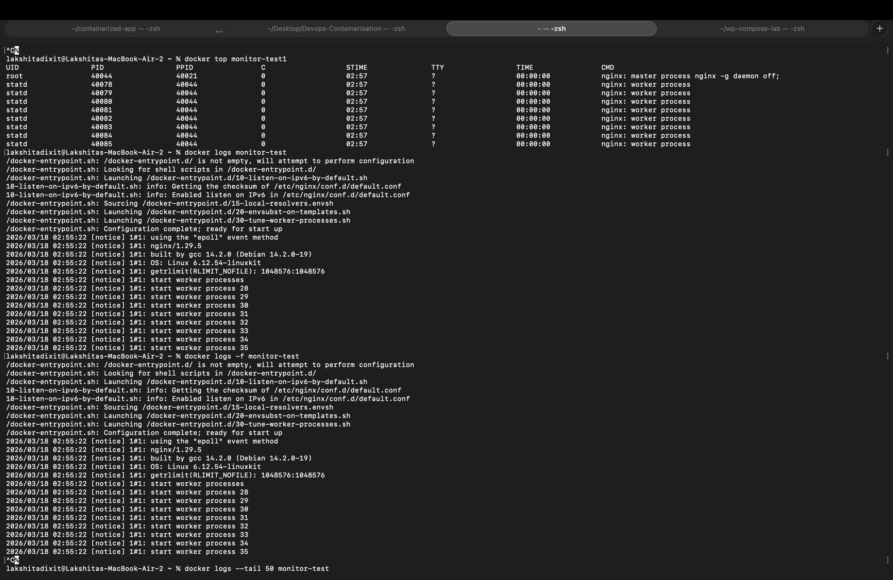
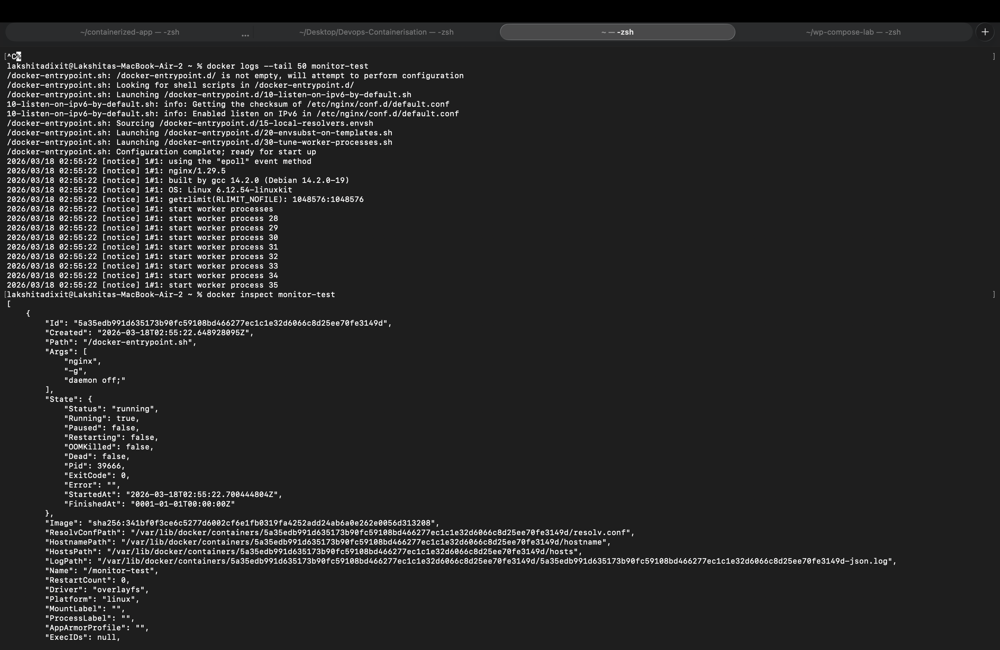
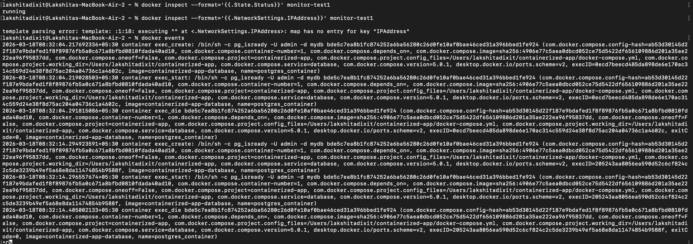

---

### Part 6: Docker Networks

docker network ls

docker network create my-network

docker network inspect my-network

docker run -d --name web1 --network my-network nginx

docker run -d --name web2 --network my-network nginx

docker exec web1 curl http://web2

docker run -d --name isolated-app --network none alpine sleep 3600

docker exec isolated-app ifconfig
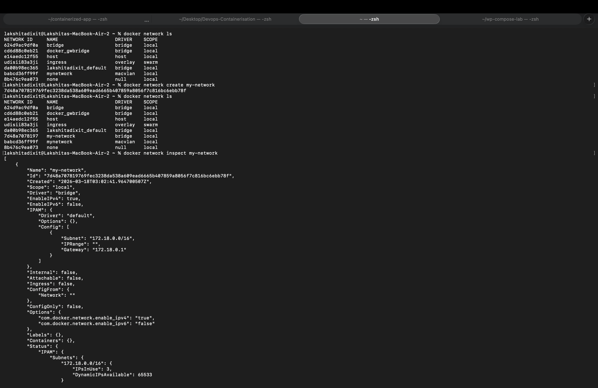
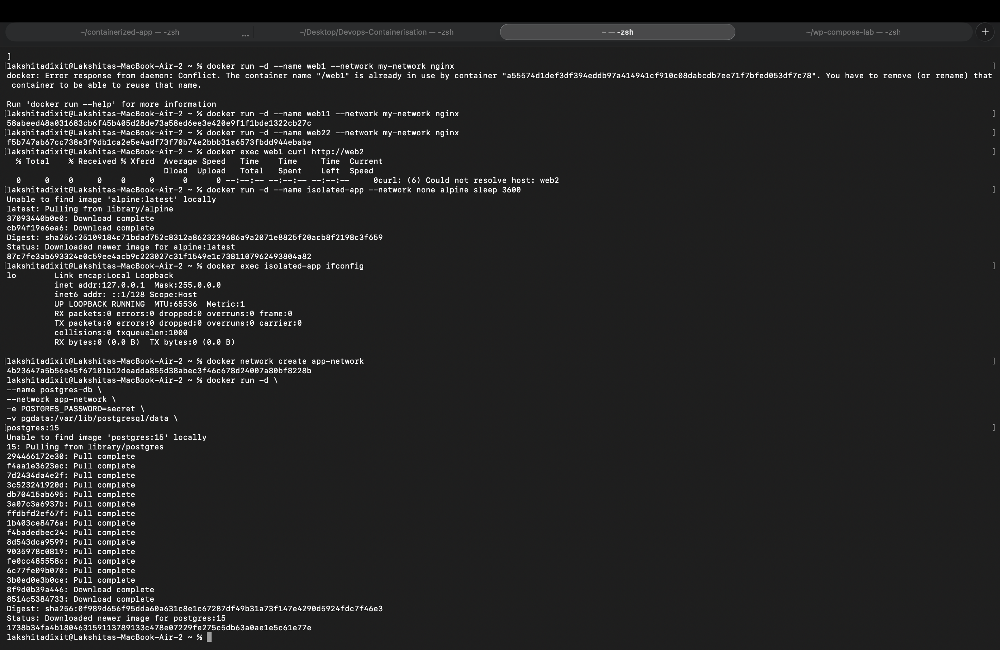
---

### Part 7: Multi Container Application

docker network create app-network

docker run -d \
--name postgres-db \
--network app-network \
-e POSTGRES_PASSWORD=secret \
-v pgdata:/var/lib/postgresql/data \
postgres:15

docker run -d \
--name web-app \
--network app-network \
-p 8080:80 \
nginx

docker ps

docker network inspect app-network

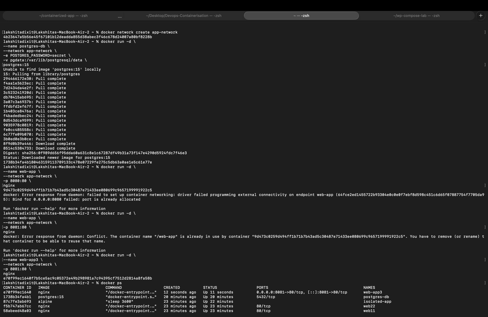

---

### Cleanup Commands

docker stop $(docker ps -aq)

docker rm $(docker ps -aq)

docker volume prune -f

docker network prune -f

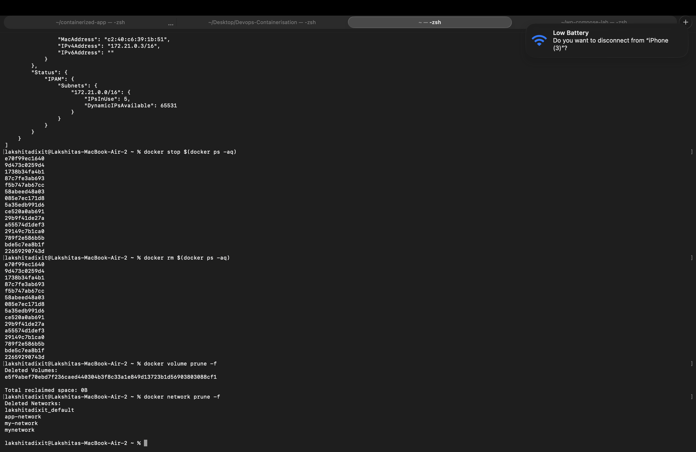

---

## Observations

- Docker containers do not persist data unless volumes are used.
- Environment variables help configure containers.
- Docker stats shows container resource usage.
- Docker networks allow container communication.
- Multi container applications communicate using custom networks.

## Result

Docker volumes, environment variables, monitoring commands and Docker networks were successfully implemented and tested.

## Challenges Faced

- Missing directories inside container
- Image not found errors
- Port conflicts
- Network communication testing issues
- Environment variable verification

## Conclusion

Docker provides efficient container management using volumes, environment variables, monitoring tools and networking. These features help in building scalable and production ready containerized applications.