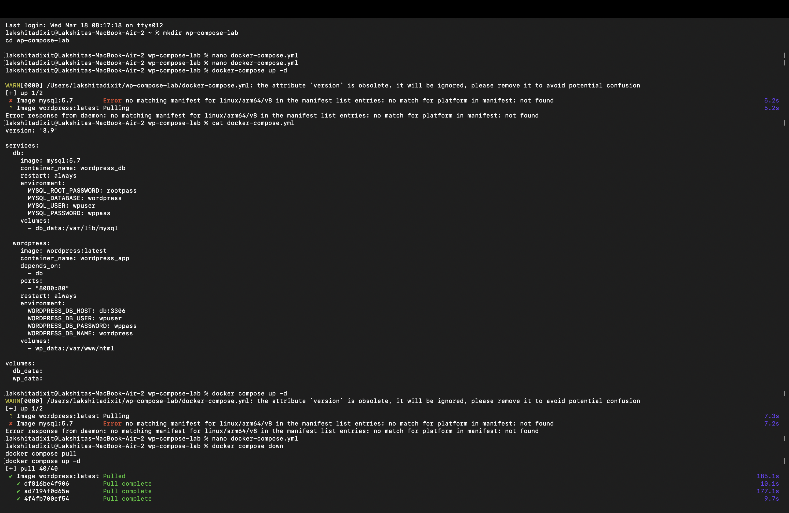
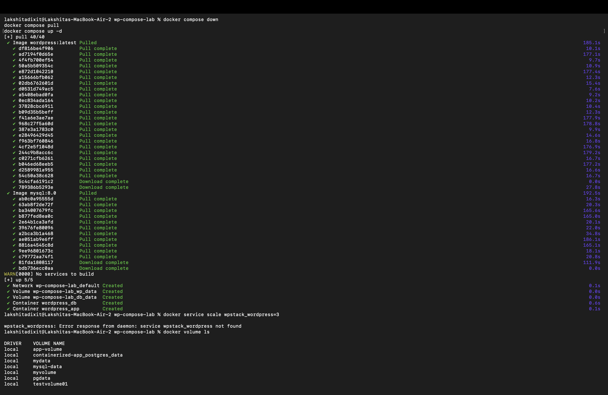
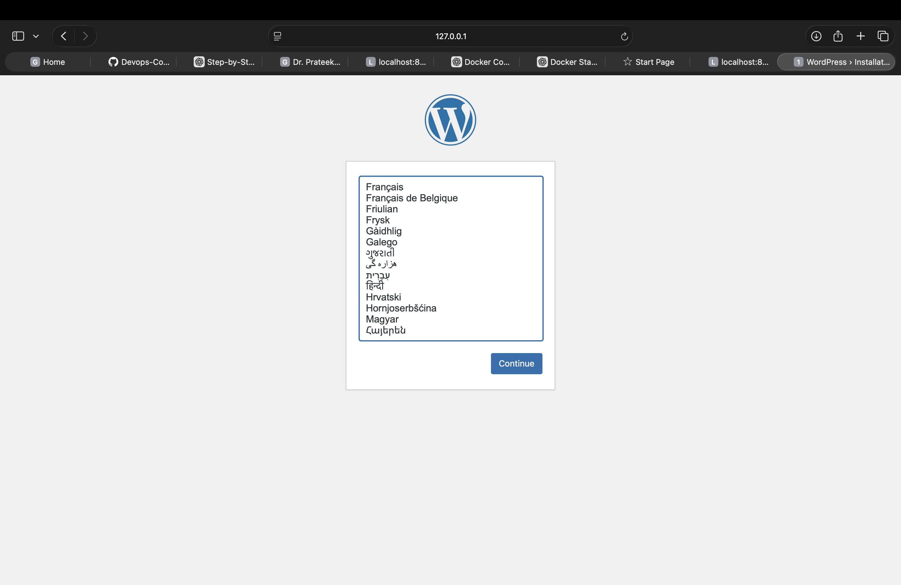
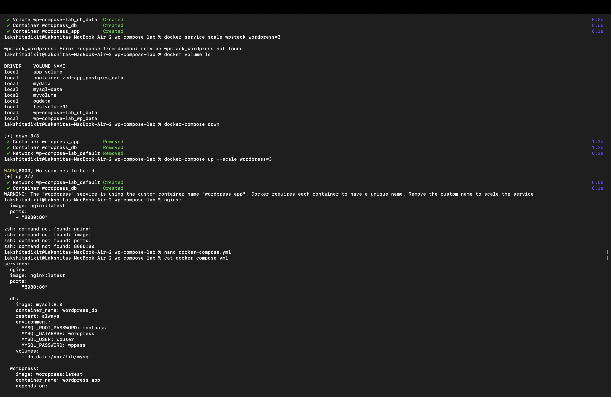
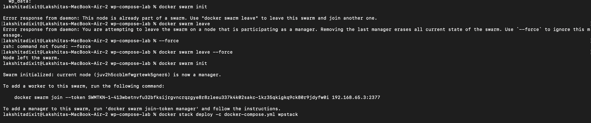
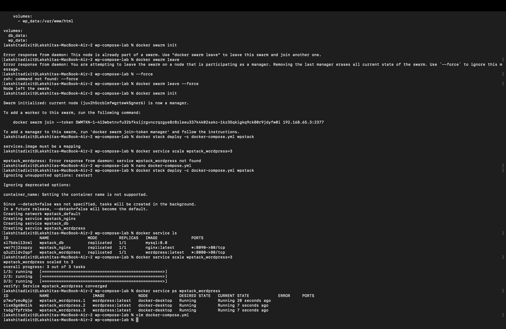

## Name : Lakshita Dixit
## SAP ID : 500125823
## Batch : 3 (CCVT)

# Experiment 6B  
# Multi-Container Application using Docker Compose (WordPress + MySQL)

---

# Aim

To deploy a multi-container application using Docker Compose consisting of a WordPress container and a MySQL database container. The experiment also aims to understand Docker networking, persistent volumes, service scaling, and deployment using Docker Swarm.

---

# Theory

## Docker Compose

Docker Compose is a tool used to define and manage multi-container Docker applications. Using a YAML file, we can configure application services, networks, and volumes. Instead of running multiple docker run commands, Docker Compose allows starting the complete application stack using a single command.

Example:

```
docker compose up -d
```

## Multi-Container Architecture

The architecture consists of two main services:

**WordPress Container**
- Frontend application
- PHP based CMS
- Connects to database

**MySQL Container**
- Backend database
- Stores WordPress data
- Provides persistence

Architecture flow:

```
User Browser
     |
WordPress Container
     |
MySQL Container
     |
Docker Volume (Persistent Storage)
```

## Docker Networking

Docker Compose automatically creates a network where services communicate using service names instead of IP addresses.

Example:

```
WORDPRESS_DB_HOST=db:3306
```

Here db acts as a DNS hostname inside the Docker network.

## Docker Volumes

Volumes allow data persistence even if containers are removed.

Examples:

db_data → MySQL storage  
wp_data → WordPress files  

## Docker Scaling

Docker Compose allows scaling:

```
docker compose up --scale wordpress=3
```

Limitations:

- No load balancing
- Port conflicts
- Single host deployment
- Not production ready

## Docker Swarm

Docker Swarm is Docker's native orchestration tool providing:

- Built-in load balancing
- Service scaling
- Self healing
- Rolling updates
- Multi node clustering

Example:

```
docker swarm init
docker stack deploy -c docker-compose.yml wpstack
docker service scale wpstack_wordpress=3
```

---

# Requirements

## Software Required

- Docker Desktop
- Docker Compose
- Web Browser

## Knowledge Required

- Basic Docker commands
- Containers concept
- YAML basics

---

# Procedure

## Step 1: Create Project Directory

Command:

```
mkdir wp-compose-lab
cd wp-compose-lab
```

---

## Step 2: Create docker-compose.yml

Command:

```
nano docker-compose.yml
```

Configuration:

```yaml
version: '3.9'

services:

  nginx:
    image: nginx:latest
    ports:
      - "8080:80"

  db:
    image: mysql:8.0
    container_name: wordpress_db
    restart: always

    environment:
      MYSQL_ROOT_PASSWORD: rootpass
      MYSQL_DATABASE: wordpress
      MYSQL_USER: wpuser
      MYSQL_PASSWORD: wppass

    volumes:
      - db_data:/var/lib/mysql

  wordpress:
    image: wordpress:latest
    container_name: wordpress_app

    depends_on:
      - db

    ports:
      - "8000:80"

    restart: always

    environment:
      WORDPRESS_DB_HOST: db:3306
      WORDPRESS_DB_USER: wpuser
      WORDPRESS_DB_PASSWORD: wppass
      WORDPRESS_DB_NAME: wordpress

    volumes:
      - wp_data:/var/www/html

volumes:
  db_data:
  wp_data:
```


---

## Step 3: Start Application

Command:

```
docker compose up -d
```

What happens:

- Required images are downloaded
- Docker network is created
- Volumes are created
- Containers are started

---

## Step 4: Verify Containers

Command:

```
docker ps
```

Expected output:

```
wordpress_app
wordpress_db
nginx
```

---

## Step 5: Access WordPress

Open browser:

```
http://localhost:8080
```


Observation:

WordPress installation screen appears.

Setup includes:

- Language selection
- Site title
- Admin username
- Password

---

## Step 6: Check Volumes

Command:

```
docker volume ls
```

Observed:

```
wp-compose-lab_db_data
wp-compose-lab_wp_data
```

Purpose:

- Database persistence
- WordPress data persistence

---

## Step 7: Stop Application

Command:

```
docker compose down
```

Result:

- Containers removed
- Network removed
- Volumes remain intact

---

# Scaling Experiment

## Scaling WordPress Service

Command:

```
docker compose up --scale wordpress=3
```

Observation:

Error due to fixed container name.

Error reason:

Docker requires unique container names for scaling.

Solution:

Remove:

```
container_name: wordpress_app
```

Then scaling works correctly.

---

# Docker Swarm Deployment

## Step 1: Initialize Swarm

Command:

```
docker swarm init
```


Observation:

Node initialized as manager.

---

## Step 2: Deploy Stack

Command:

```
docker stack deploy -c docker-compose.yml wpstack
```

Observation:

Services created:

```
wpstack_db
wpstack_wordpress
wpstack_nginx
```

---

## Step 3: Verify Services

Command:

```
docker service ls
```

Observed services:

```
wpstack_db
wpstack_nginx
wpstack_wordpress
```

---

## Step 4: Scale Service

Command:

```
docker service scale wpstack_wordpress=3
```

Observation:

```
overall progress: 3 out of 3 tasks
verify: Service converged
```

---

## Step 5: Verify Replicas

Command:

```
docker service ps wpstack_wordpress
```

Observation:

Three WordPress containers running successfully.

---

# Observations

## Container Deployment

- MySQL container started successfully
- WordPress connected to database
- Nginx exposed port successfully

## Volume Persistence

Volumes created:

```
wp-compose-lab_db_data
wp-compose-lab_wp_data
```

Data remained after container removal.

## Networking

WordPress successfully connected to MySQL using service DNS name.

## Swarm Scaling

Service scaled from:

```
1 → 3 replicas
```

Docker created additional containers automatically.

## Browser Result

WordPress installation page displayed successfully confirming proper deployment.

---

# Challenges Faced

## Issue 1: MySQL 5.7 ARM Architecture Error

Error:

```
no matching manifest for linux/arm64/v8
```

Cause:

Mac system uses ARM architecture.

Solution:

Changed image:

```
mysql:5.7 → mysql:8.0
```

---

## Issue 2: Container Name Conflict During Scaling

Error:

```
Docker requires each container to have a unique name
```

Cause:

container_name prevents scaling.

Solution:

Removed container_name from docker-compose.yml.

---

## Issue 3: Swarm Already Initialized

Error:

```
This node is already part of a swarm
```

Solution:

```
docker swarm leave --force
docker swarm init
```

---

## Issue 4: Incorrect YAML Commands Typed in Terminal

Error:

```
zsh: command not found: nginx:
```

Cause:

YAML was typed directly in terminal instead of file.

Solution:

Edit docker-compose.yml using nano.

---

# Result

The multi-container WordPress application was successfully deployed using Docker Compose. The WordPress container successfully communicated with the MySQL database container using Docker networking. Persistent storage was achieved using Docker volumes. The services were successfully scaled using Docker Swarm demonstrating container orchestration capabilities.

---

# Conclusion

This experiment demonstrated how Docker Compose simplifies multi-container deployment and how Docker Swarm enables production level orchestration features such as scaling and load balancing. The experiment also highlighted practical challenges such as architecture compatibility, container naming conflicts, and service scaling limitations.

---

# Learning Outcomes

After completing this experiment, the following concepts were understood:

- Docker Compose multi container deployment
- Docker networking
- Docker volumes
- Container scaling
- Docker Swarm orchestration
- Service replication
- Load balancing concept
- Production deployment differences

---