### Name : LAKSHITA DIXIT
### SAP ID : 500125823

## EXPERIMENT 7 : CI/CD Pipeline Setup using GitHub, Docker, and Jenkins
The objective of this project is to design and implement a complete CI/CD (Continuous Integration and Continuous Deployment) pipeline using GitHub, Docker, and Jenkins. This pipeline automates code integration, Docker image building, and pushing images to Docker Hub.

## Objectives

- Understand CI/CD workflow using Jenkins (GUI-based tool)  
- Create a structured GitHub repository with application + Jenkinsfile  
- Build Docker images from source code  
- Securely store Docker Hub credentials in Jenkins  
- Automate build & push process using webhook triggers  
- Use same host (Docker) as Jenkins agent  

## Theory

### What is Jenkins?
Jenkins is a web-based GUI automation server used to:
- Build applications  
- Test code  
- Deploy software  

It provides:
- Dashboard (browser-based UI)  
- Plugin ecosystem (GitHub, Docker, etc.)  
- Pipeline as Code using Jenkinsfile  

---

### What is CI/CD?

**Continuous Integration (CI):**
- Code is automatically built and tested after each commit  

**Continuous Deployment (CD):**
- Built artifacts (Docker images) are automatically delivered/deployed  

---

### Workflow Overview
Developer → GitHub → Webhook → Jenkins → Build → Docker Hub  

---

### Prerequisites
- Docker & Docker Compose installed  
- GitHub account  
- Docker Hub account  
- Basic Linux command knowledge  


## Part A: GitHub Repository Setup (Source Code + Build Definition)

### 5.1 Create Repository
Create a repository on GitHub named and clone it in your system by pasting its url on your terminal :
_my-app_

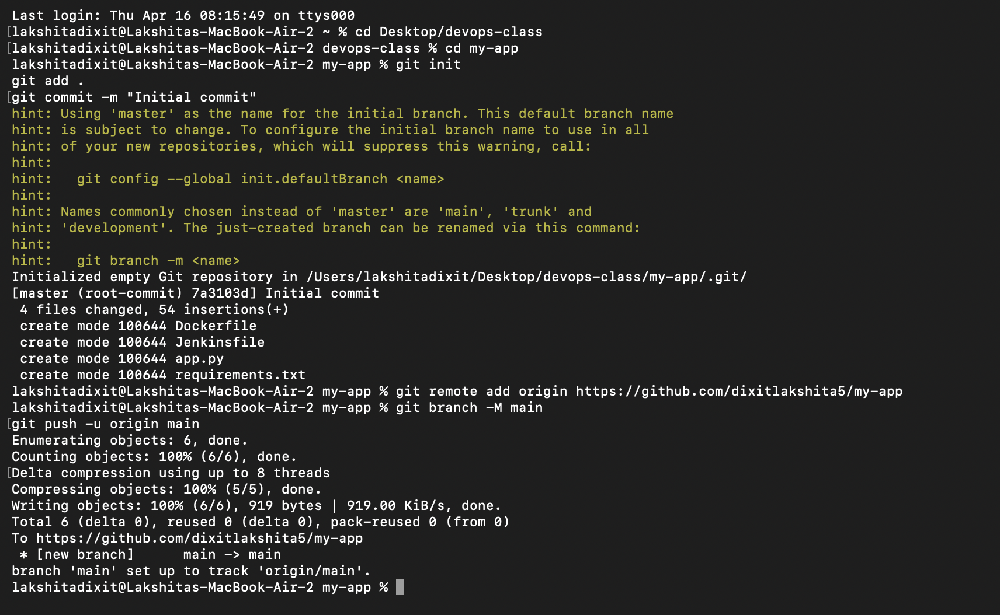

---

### 5.2 Project Structure
my-app/
├── app.py
├── requirements.txt
├── Dockerfile
├── Jenkinsfile
 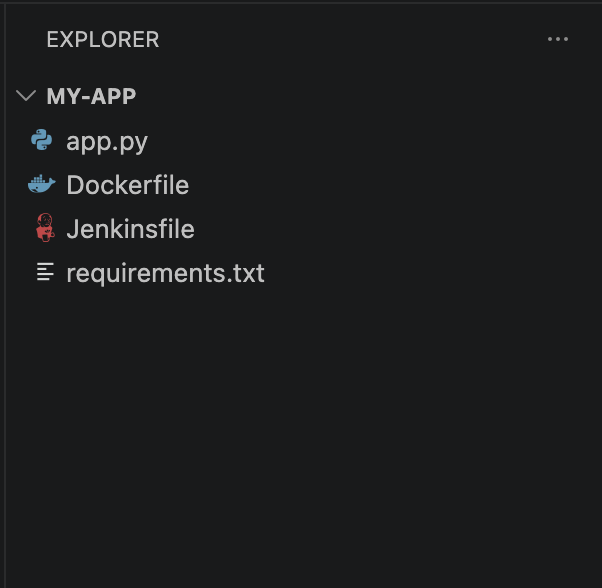


---

### 5.3 Application Code

#### app.py
```python
from flask import Flask
app = Flask(__name__)

@app.route("/")
def home():
    return "Hello from CI/CD Pipeline!"
    # return "Hello from CI/CD Pipeline!, my sapid is 123456"

app.run(host="0.0.0.0", port=80)
```

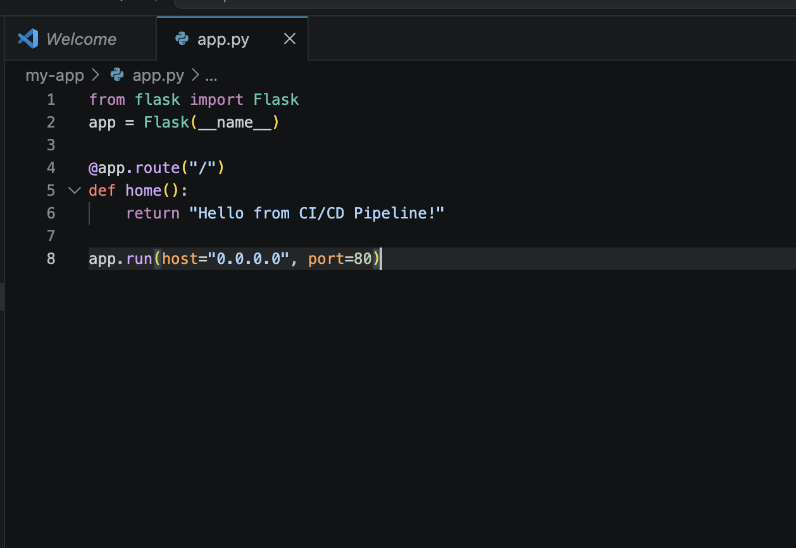

---

#### requirements.txt
```flask```

---

### 5.4 Dockerfile (Build Process)

#### Dockerfile
```dockerfile
FROM python:3.10-slim

WORKDIR /app
COPY . .

RUN pip install -r requirements.txt

EXPOSE 80
CMD ["python", "app.py"]
```
---

### Build Process Explanation
1. Developer pushes source code to GitHub
2. Jenkins pulls the latest code
3. Dockerfile:
   - Creates environment
   - Installs dependencies
   - Packages application
4. Output → Docker Image

---

### 5.5 Jenkinsfile (Pipeline Definition)
```bash
pipeline {
    agent any

    environment {
        IMAGE_NAME = "your-dockerhub-username/myapp"
    }

    stages {

        stage('Clone Source') {
            steps {
                git 'https://github.com/your-username/my-app.git'
            }
        }

        stage('Build Docker Image') {
            steps {
                sh 'docker build -t $IMAGE_NAME:latest .'
            }
        }

        stage('Login to Docker Hub') {
            steps {
                withCredentials([string(credentialsId: 'dockerhub-token', variable: 'DOCKER_TOKEN')]) {
                    sh 'echo $DOCKER_TOKEN | docker login -u your-dockerhub-username --password-stdin'
                }
            }
        }

        stage('Push to Docker Hub') {
            steps {
                sh 'docker push $IMAGE_NAME:latest'
            }
        }
    }
}
```

## Refer to this example to know where to make chaneges

```groovy
pipeline {
    agent any

    environment {
        IMAGE_NAME = "lakshitadixit5/myapp"
    }

    stages {

        stage('Clone Source') {
            steps {
                git branch: 'main', url: 'https://github.com/dixitlakshita5/my-app.git'
            }
        }

        stage('Build Docker Image') {
            steps {
                sh 'docker build -t $IMAGE_NAME:latest .'
            }
        }

        stage('Login to Docker Hub') {
            steps {
                withCredentials([string(credentialsId: 'dockerhub-token', variable: 'DOCKER_TOKEN')]) {
                    sh 'echo $DOCKER_TOKEN | docker login -u lakshitadixit5 --password-stdin'
                }
            }
        }

        stage('Push to Docker Hub') {
            steps {
                sh 'docker push $IMAGE_NAME:latest'
            }
        }
    }
}
```
---

## Part B: Jenkins Setup using Docker (Persistent Configuration)

### STEP 1: Create docker compose file


version: '3.8'

services:
  jenkins:
    image: jenkins/jenkins:lts
    container_name: jenkins
    restart: always
    ports:
      - "8080:8080"
      - "50000:50000"
    volumes:
      - jenkins_home:/var/jenkins_home
      - /var/run/docker.sock:/var/run/docker.sock
    user: root

volumes:
  jenkins_home:

### STEP 2: Start Jenkins

- docker-compose up -d

- Access local host 


### STEP 3 : Unlock Jenkins 

- docker exec -it jenkins cat /var/jenkins_home/secrets/initialAdminPassword
- Install all required plugins 

- Optional : To access your Jenkins from another device you need to make it public hence you can get a public ip from npm local tunnel and Configure your Jenkins.


### STEP 4 : Initial Setup
- Install suggested plugins
- Create admin user

---

## Part C: Jenkins Configuration

### Pre-requisite : Create Docker access token if you don't already have one

1. Login to Docker hub
2. Click on Profile -> Settings -> Personal Access tokens 
3. Create Access token 
4. Write something in the description of access token 
5. Set permissions to read, write, delete (DO NOT SET THE PERMISSION TO "READ ONLY")
6. Generate token 
7. Your token is generated 

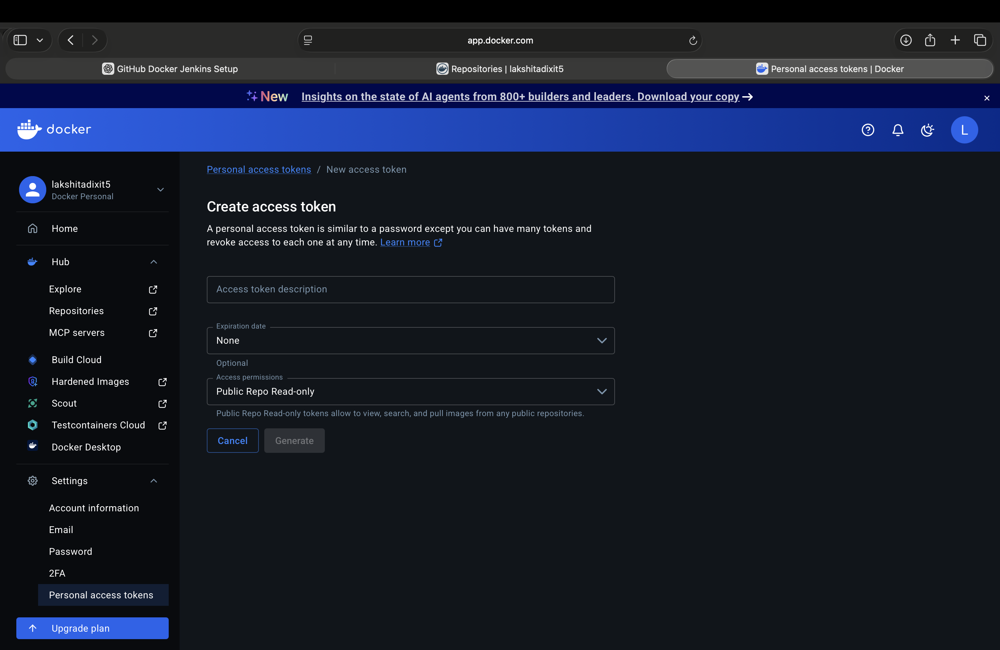
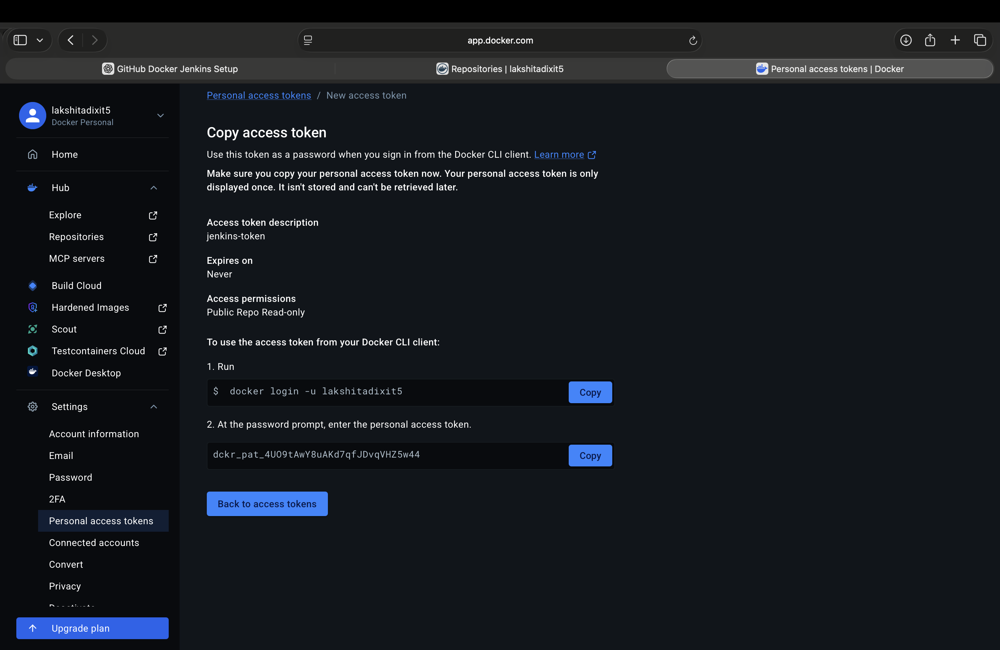


### 7.1 Add Docker Hub Credentials
Path:
Manage Jenkins → Credentials → Add Credentials

Type: Secret Text  
ID: dockerhub-token  
Value: Docker Hub Access Token  

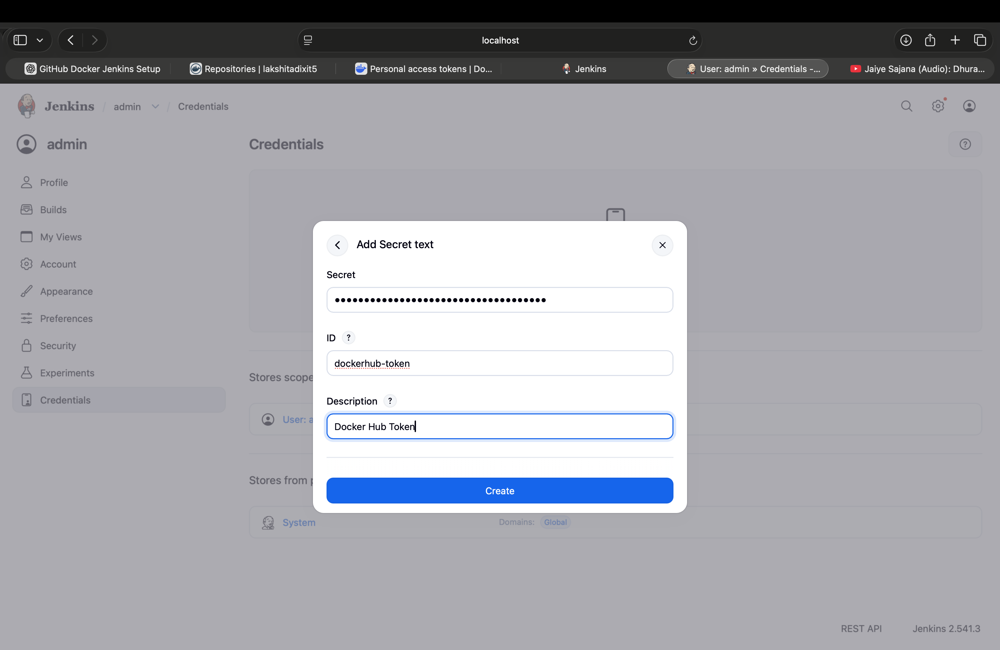
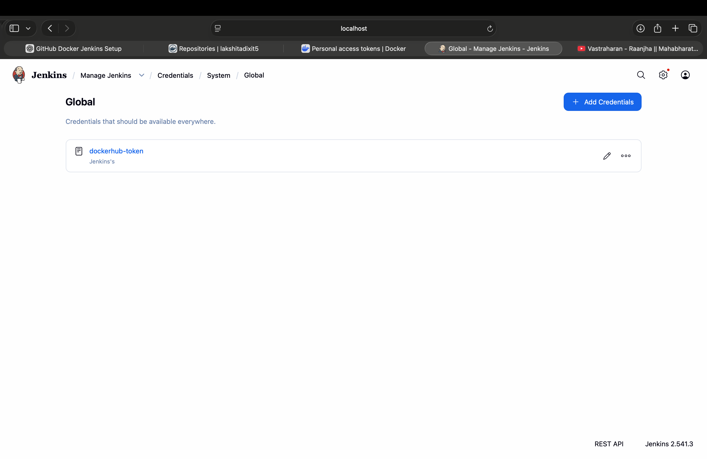

---

### 7.2 Create Pipeline Job
New Item → Pipeline  
Name: ci-cd-pipeline  

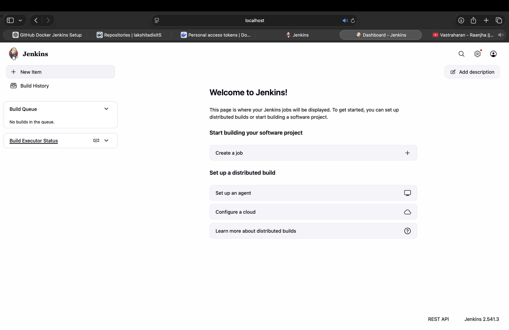
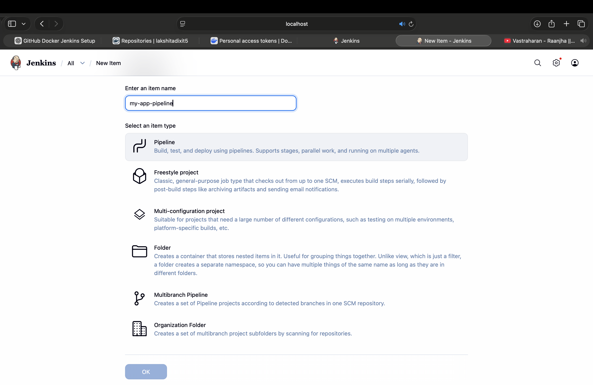


Configure:
- Pipeline script from SCM  
- SCM: Git  
- Repo URL: your GitHub repo  
- Script Path: Jenkinsfile  

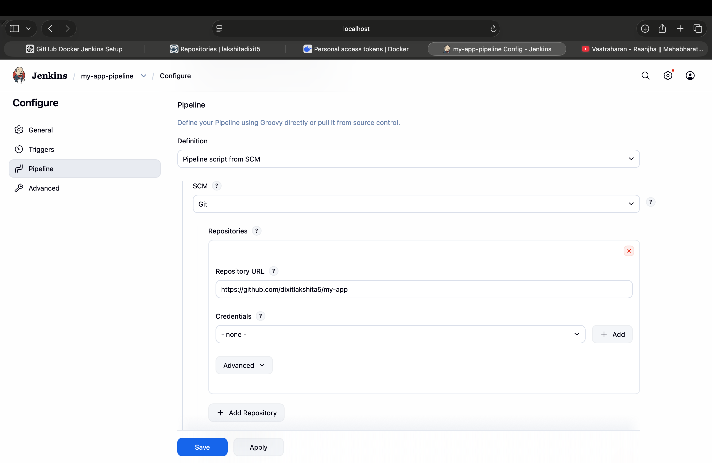
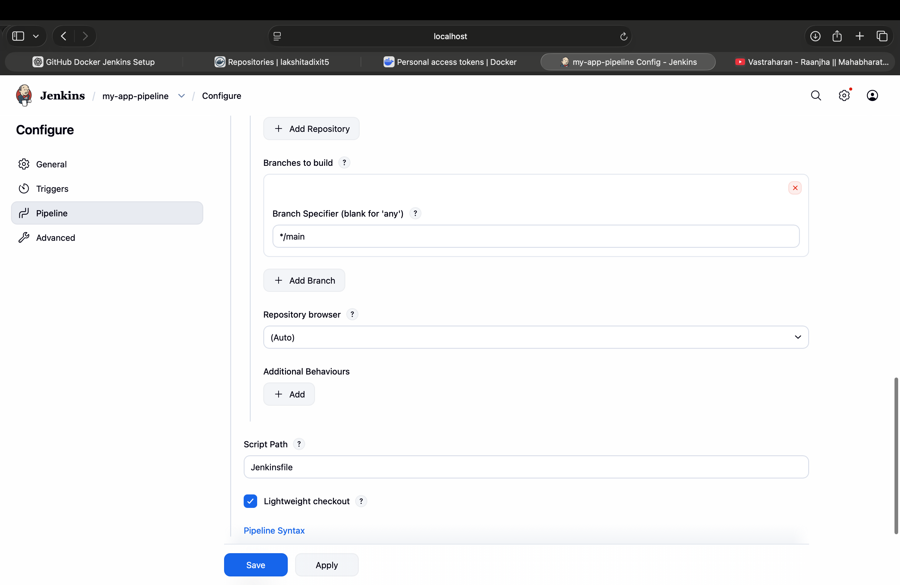

---

## Complete CI/CD Flow
1. Code is pushed to GitHub
2. Jenkins pipeline is triggered
3. Jenkins:
   - Clones repository
   - Builds Docker image
   - Logs into Docker Hub
   - Pushes image
4. Final Output:
   Docker image ready for deployment anywhere

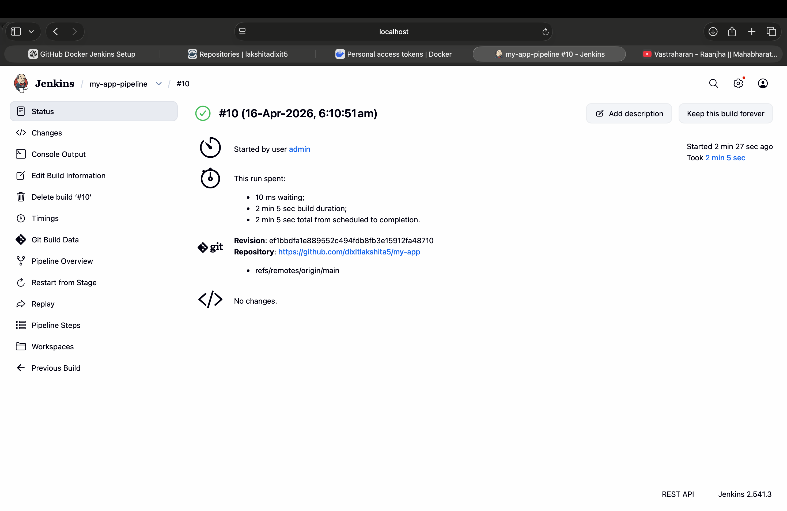
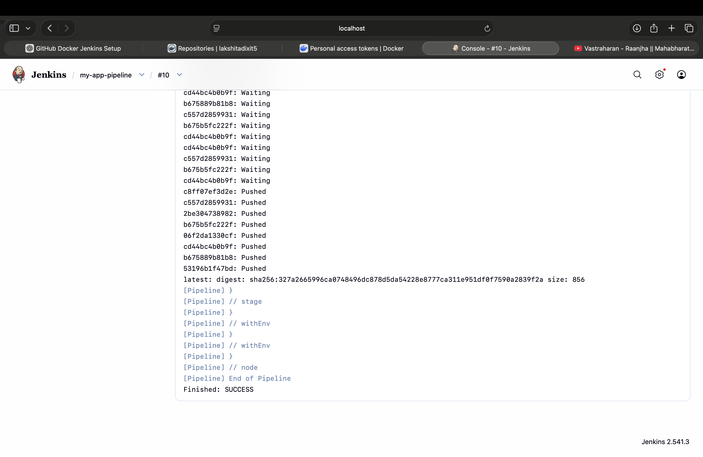

---

## Accessible through terminal on any device

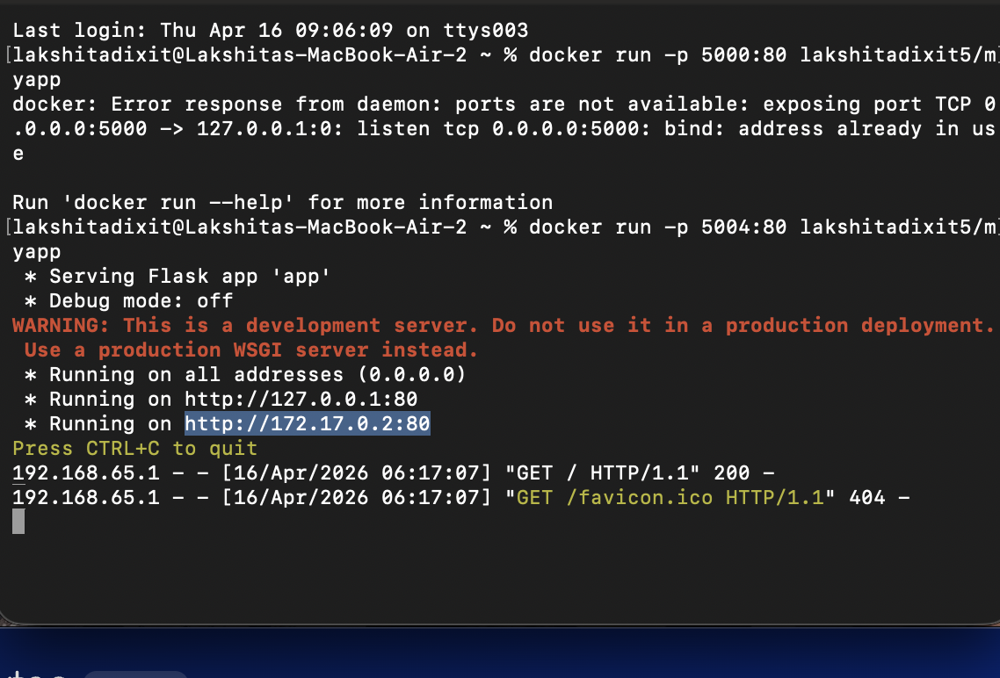
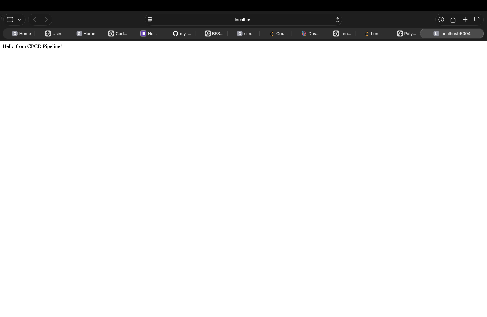
  

## Observations
- Automation reduces manual effort
- Docker ensures consistent environments
- Jenkins integrates well with GitHub
- Pipeline execution is fast and repeatable

---

## Problems Faced
- Error in repository branch of git hub
  - Changed repostory from master to main
  - 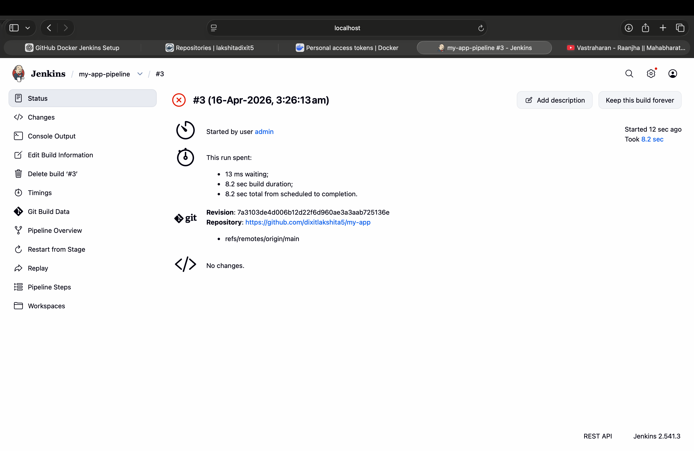
  - 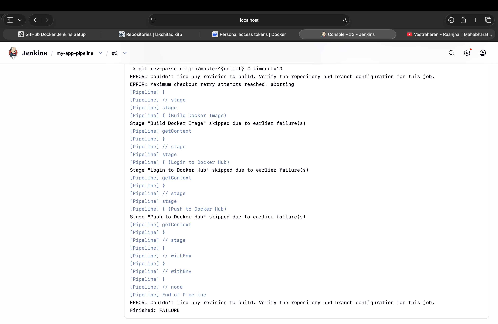
  - 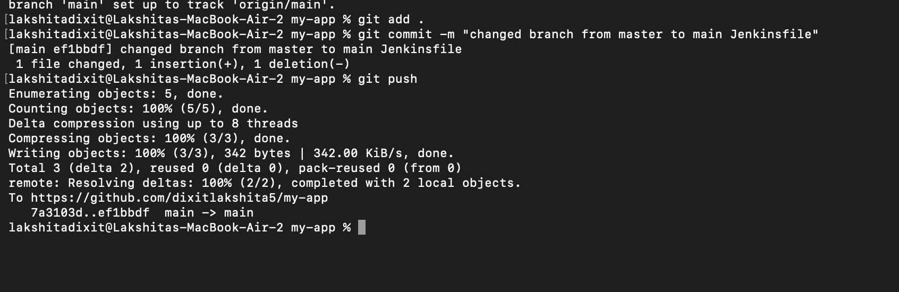
  - 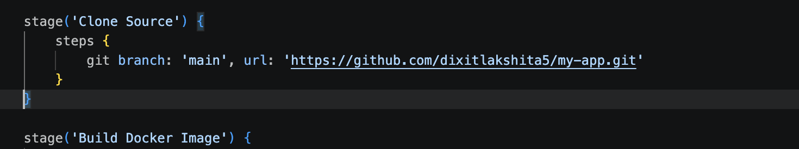


- Docker Hub authentication errors because the token generated was read only.
  - Generated a new token with read, write, only permissions in the docker hub.

- Incorrect credentials configuration as the credentials that were being generated were not gloabal.
  - Generated credentials which were gloabl in jenkins.


---

## Learning Outcomes
- Learned CI/CD pipeline concepts
- Understood Docker containerization
- Gained experience with Jenkins pipelines
- Learned secure credential management
- Understood end-to-end DevOps workflow

---

## Conclusion
This project demonstrates a complete CI/CD pipeline using GitHub, Docker, and Jenkins, showing how automation improves efficiency, reliability, and scalability in modern software development.