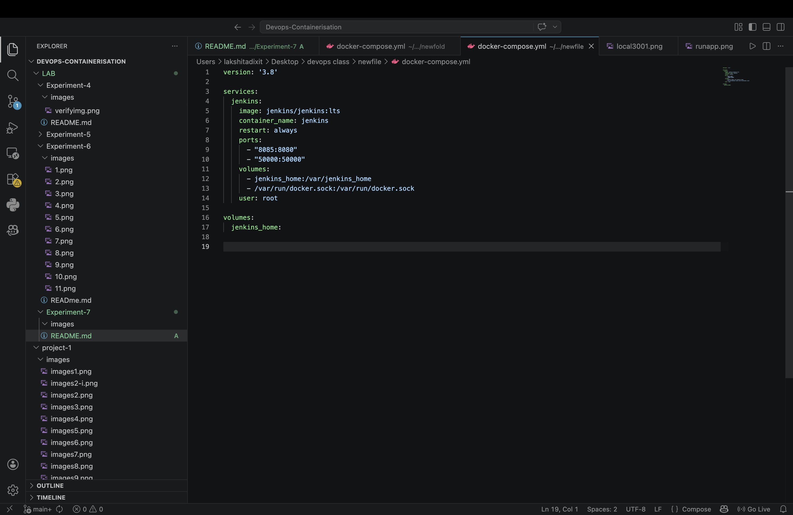
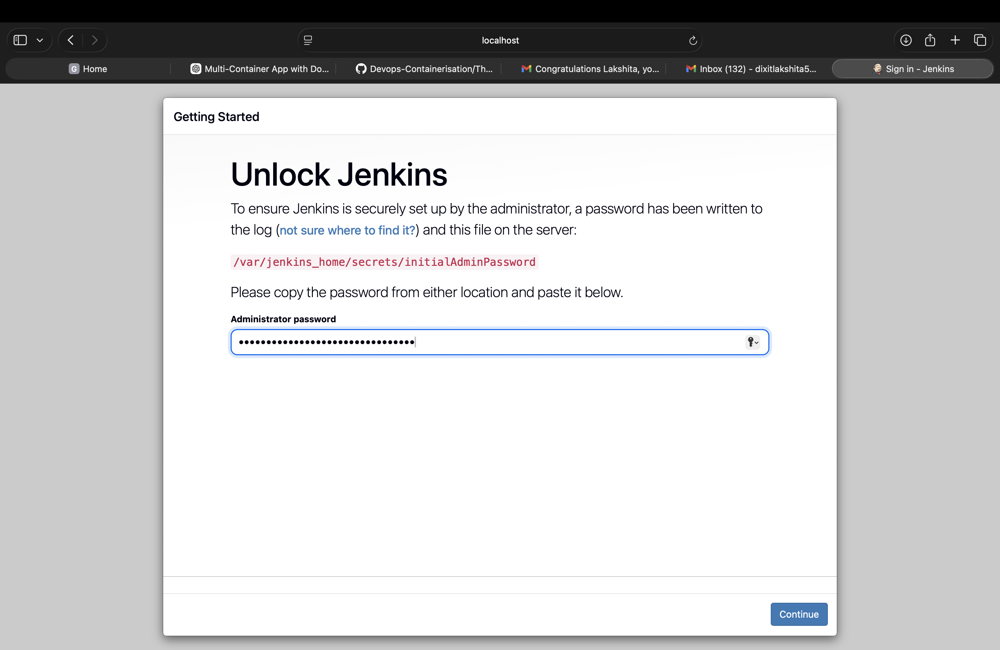
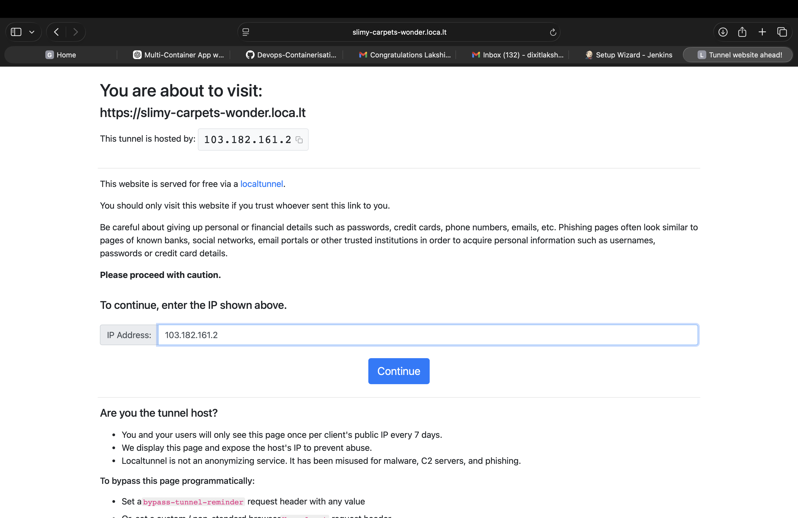

### STEP 1: Create docker compose file

### STEP 2: Start Jenkins

- Access local host 

### STEP 3 : Unlock Jenkins 

- docker exec -it jenkins cat /var/jenkins_home/secrets/initialAdminPassword
- Install all required plugins 

- Optional : To access your Jenkins from another device you need to make it public hence you can get a public ip from npm local tunnel and Configure your Jenkins.

# CI/CD Pipeline Setup using GitHub, Docker, and Jenkins

## Objective
The objective of this project is to design and implement a complete CI/CD (Continuous Integration and Continuous Deployment) pipeline using GitHub, Docker, and Jenkins. This pipeline automates code integration, Docker image building, and pushing images to Docker Hub.

---

## Part A: GitHub Repository Setup (Source Code + Build Definition)

### 5.1 Create Repository
Create a repository on GitHub named:
my-app

---

### 5.2 Project Structure
my-app/
├── app.py
├── requirements.txt
├── Dockerfile
├── Jenkinsfile

---

### 5.3 Application Code

#### app.py
from flask import Flask
app = Flask(__name__)

@app.route("/")
def home():
    return "Hello from CI/CD Pipeline!"
    # return "Hello from CI/CD Pipeline!, my sapid is 123456"

app.run(host="0.0.0.0", port=80)

---

#### requirements.txt
flask

---

### 5.4 Dockerfile (Build Process)

#### Dockerfile
FROM python:3.10-slim

WORKDIR /app
COPY . .

RUN pip install -r requirements.txt

EXPOSE 80
CMD ["python", "app.py"]

---

### Build Process Explanation
1. Developer pushes source code to GitHub
2. Jenkins pulls the latest code
3. Dockerfile:
   - Creates environment
   - Installs dependencies
   - Packages application
4. Output → Docker Image

---

### 5.5 Jenkinsfile (Pipeline Definition)

pipeline {
    agent any

    environment {
        IMAGE_NAME = "your-dockerhub-username/myapp"
    }

    stages {

        stage('Clone Source') {
            steps {
                git 'https://github.com/your-username/my-app.git'
            }
        }

        stage('Build Docker Image') {
            steps {
                sh 'docker build -t $IMAGE_NAME:latest .'
            }
        }

        stage('Login to Docker Hub') {
            steps {
                withCredentials([string(credentialsId: 'dockerhub-token', variable: 'DOCKER_TOKEN')]) {
                    sh 'echo $DOCKER_TOKEN | docker login -u your-dockerhub-username --password-stdin'
                }
            }
        }

        stage('Push to Docker Hub') {
            steps {
                sh 'docker push $IMAGE_NAME:latest'
            }
        }
    }
}

---

## Part B: Jenkins Setup using Docker (Persistent Configuration)

### 6.1 Create Docker Compose File

version: '3.8'

services:
  jenkins:
    image: jenkins/jenkins:lts
    container_name: jenkins
    restart: always
    ports:
      - "8080:8080"
      - "50000:50000"
    volumes:
      - jenkins_home:/var/jenkins_home
      - /var/run/docker.sock:/var/run/docker.sock
    user: root

volumes:
  jenkins_home:

---

### 6.2 Start Jenkins
docker-compose up -d

Access:
http://localhost:8080

---

### 6.3 Unlock Jenkins
docker exec -it jenkins cat /var/jenkins_home/secrets/initialAdminPassword

---

### 6.4 Initial Setup
- Install suggested plugins
- Create admin user

---

## Part C: Jenkins Configuration

### 7.1 Add Docker Hub Credentials
Path:
Manage Jenkins → Credentials → Add Credentials

Type: Secret Text  
ID: dockerhub-token  
Value: Docker Hub Access Token  

---

### 7.2 Create Pipeline Job
New Item → Pipeline  
Name: ci-cd-pipeline  

Configure:
- Pipeline script from SCM  
- SCM: Git  
- Repo URL: your GitHub repo  
- Script Path: Jenkinsfile  

---

## Complete CI/CD Flow
1. Code is pushed to GitHub
2. Jenkins pipeline is triggered
3. Jenkins:
   - Clones repository
   - Builds Docker image
   - Logs into Docker Hub
   - Pushes image
4. Final Output:
   Docker image ready for deployment anywhere

---

## Observations
- Automation reduces manual effort
- Docker ensures consistent environments
- Jenkins integrates well with GitHub
- Pipeline execution is fast and repeatable

---

## Problems Faced
- Docker permission issues inside Jenkins container
- Docker Hub authentication errors
- Incorrect credentials configuration
- Port conflicts
- Initial difficulty with Jenkins pipeline syntax

---

## Learning Outcomes
- Learned CI/CD pipeline concepts
- Understood Docker containerization
- Gained experience with Jenkins pipelines
- Learned secure credential management
- Understood end-to-end DevOps workflow

---

## Conclusion
This project demonstrates a complete CI/CD pipeline using GitHub, Docker, and Jenkins, showing how automation improves efficiency, reliability, and scalability in modern software development.