# Step 1: Install Required Tools (Mac)

Before anything, your Mac must have:
- Homebrew
- Docker
- Python (for Ansible)

---

## 1.1 Install Homebrew (if not already)

Open Terminal and run:
```bash
/bin/bash -c "$(curl -fsSL https://raw.githubusercontent.com/Homebrew/install/HEAD/install.sh)"
```
[1](./images/1.png)

---

## 1.2 Install Ansible

```bash
brew install ansible
```
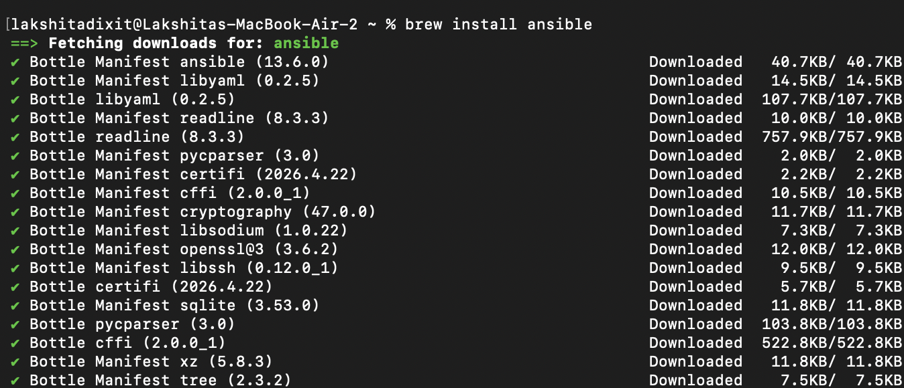

---

## 1.3 Verify Everything

Run:
```bash
ansible --version
```
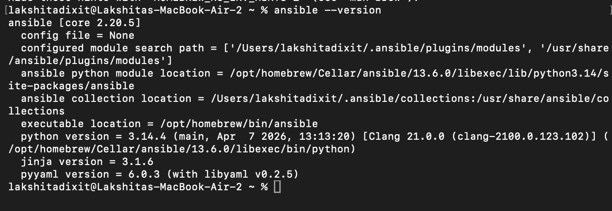

# Step 2: Create SSH Key Pair (Mac)

We need SSH keys because Ansible connects to servers using SSH (no agents).

---

## 2.1 Generate SSH Key

In Terminal, run:
```bash
ssh-keygen -t rsa -b 4096
```

1[4](./images/4.png)
---

## 2.2 When Prompted

- Press Enter for file location (default is fine)
- Press Enter for passphrase (keep it empty for simplicity in this experiment)

This will create:
- Private key → ~/.ssh/id_rsa  
- Public key → ~/.ssh/id_rsa.pub  

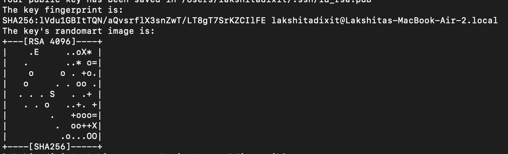

---

## 2.3 Copy Keys to Your Working Directory

First create a folder for this experiment:
```bash
mkdir ansible-exp
cd ansible-exp
```

Now copy keys:
```bash
cp ~/.ssh/id_rsa .
cp ~/.ssh/id_rsa.pub .
```
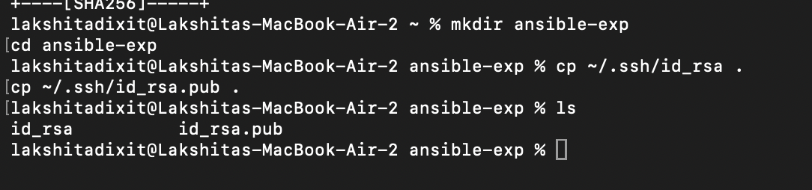
---

## 2.4 Verify Files Exist

Run:
```bash
ls
```
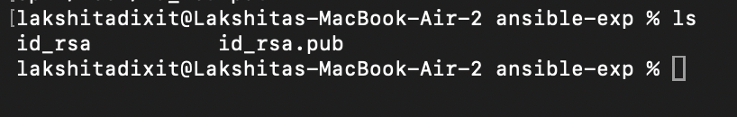

You should see:
- id_rsa  
- id_rsa.pub  

# Step 3: Create Docker Image with SSH Server

Now we’ll create a custom Ubuntu container with SSH enabled (this will act like your servers).

---

## 3.1 Create a Dockerfile

Inside your ansible-exp folder, run:
```bash
touch Dockerfile
```

Open it (you can use nano or VS Code):
```bash
nano Dockerfile
```
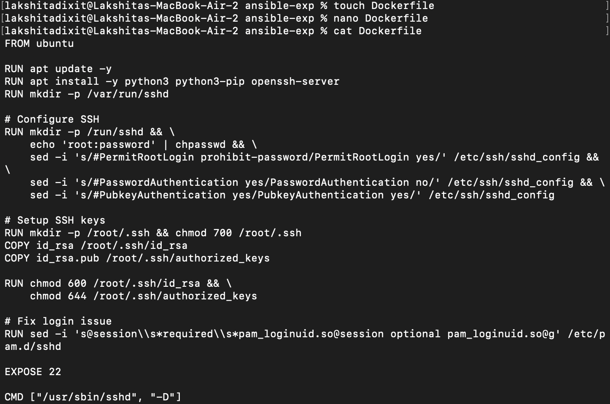

---

## 3.2 Paste This Content Inside Dockerfile

```dockerfile
FROM ubuntu

RUN apt update -y
RUN apt install -y python3 python3-pip openssh-server
RUN mkdir -p /var/run/sshd

# Configure SSH
RUN mkdir -p /run/sshd && \
    echo 'root:password' | chpasswd && \
    sed -i 's/#PermitRootLogin prohibit-password/PermitRootLogin yes/' /etc/ssh/sshd_config && \
    sed -i 's/#PasswordAuthentication yes/PasswordAuthentication no/' /etc/ssh/sshd_config && \
    sed -i 's/#PubkeyAuthentication yes/PubkeyAuthentication yes/' /etc/ssh/sshd_config

# Setup SSH keys
RUN mkdir -p /root/.ssh && chmod 700 /root/.ssh
COPY id_rsa /root/.ssh/id_rsa
COPY id_rsa.pub /root/.ssh/authorized_keys

RUN chmod 600 /root/.ssh/id_rsa && \
    chmod 644 /root/.ssh/authorized_keys

# Fix login issue
RUN sed -i 's@session\\s*required\\s*pam_loginuid.so@session optional pam_loginuid.so@g' /etc/pam.d/sshd

EXPOSE 22

CMD ["/usr/sbin/sshd", "-D"]
```

---

## 3.3 Save and Exit

If using nano:
- Press CTRL + X  
- Press Y  
- Press Enter  

---

## 3.4 Build Docker Image

Now run:
```bash
docker build -t ubuntu-server .
```

This may take a few minutes.

# ERROR : BUILD FAILURE

Your error:
- 404 Not Found (Ubuntu packages)

This happens because:
- ubuntu:latest is pointing to a newer release (24.04 / noble)
- Some package links may be temporarily broken or outdated

---

# Fix (Simple and Reliable)

Instead of using an unstable latest version, use a stable Ubuntu version.

---

## Step 3 (Fixed): Update Dockerfile

Open your Dockerfile again:
```bash
nano Dockerfile
```

---

## Replace Base Image

Replace this line:
```dockerfile
FROM ubuntu
```

With:
```dockerfile
FROM ubuntu:22.04
```

---

## Improve Install Command

Replace this:
```dockerfile
RUN apt update -y
RUN apt install -y python3 python3-pip openssh-server
```

With:
```dockerfile
RUN apt-get update && apt-get install -y python3 python3-pip openssh-server
```
 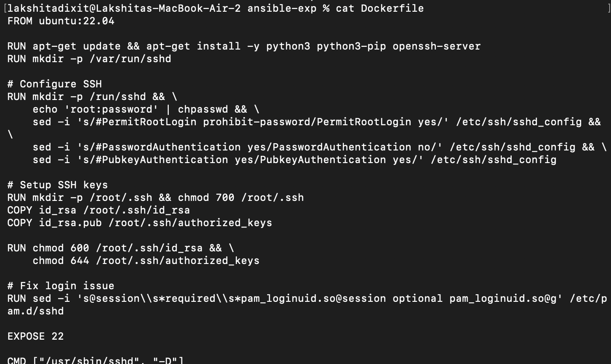
---

## Save and Rebuild

```bash
docker build -t ubuntu-server .
```
---

## 3.5 Verify Image

```bash
docker images
```

You should see:
- ubuntu-server

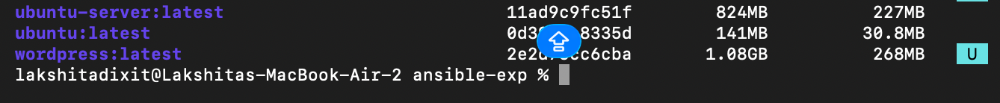

# Step 4: Run Docker Container + Test SSH

Now we’ll start a server (container) and verify SSH access.

---

## 4.1 Run Container

In your terminal:
```bash
docker run -d -p 2222:22 --name ssh-test-server ubuntu-server
```

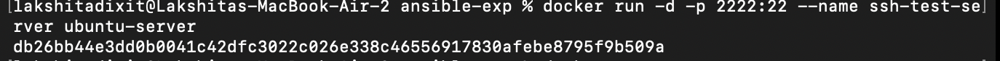
This means:
- Port 2222 (Mac) → mapped to 22 (container SSH)

---

## 4.2 Check Container is Running

```bash
docker ps
```

You should see the server 

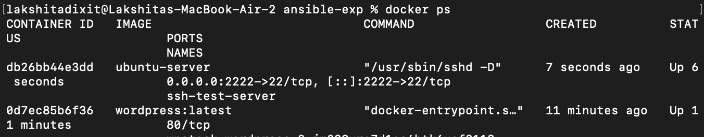

---

## 4.3 Test SSH Login (Key-Based)

```bash
ssh -i ~/.ssh/id_rsa root@localhost -p 2222
```
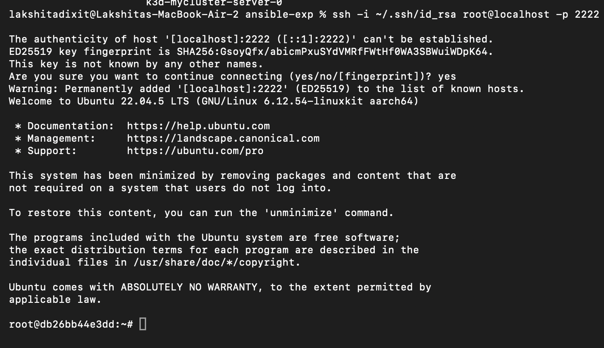

# Step 5: Create Multiple Servers (Docker Containers)

We’ll now create 4 servers that Ansible will manage.

---

## 5.1 Run Multiple Containers

Run this command after exiting the container:
```bash
for i in {1..4}; do
  echo "Creating server$i"
  docker run -d -p 220$i:22 --name server$i ubuntu-server
done
```
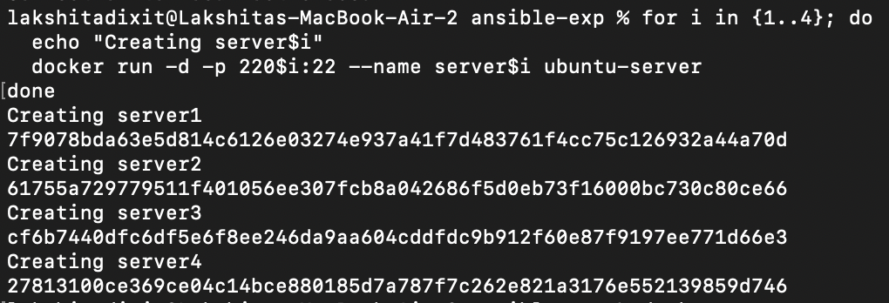


---

## 5.2 Verify Containers

```bash
docker ps
```

You should see:
- server1  
- server2  
- server3  
- server4  

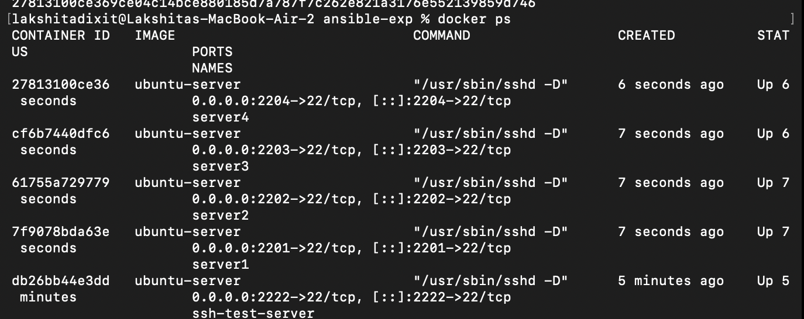
---

## 5.3 (Optional but Useful) Get IPs

```bash
for i in {1..4}; do
  docker inspect -f '{{range.NetworkSettings.Networks}}{{.IPAddress}}{{end}}' server$i
done
```
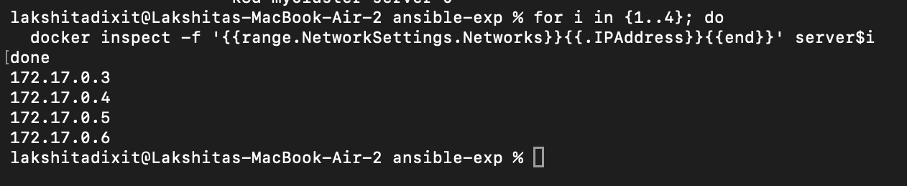
---

## What We Did

- Created 4 mini servers  
- Each one is accessible via:
  - localhost:2201  
  - localhost:2202  
  - localhost:2203  
  - localhost:2204  


# Step 6: Create Ansible Inventory File

This file tells Ansible which servers to manage and how to connect.

---

## 6.1 Create the File

In your ansible-exp folder:
```bash
touch inventory.ini
```

Open it:
```bash
nano inventory.ini
```

---

## 6.2 Add This Content

Paste this exactly:
```ini
[servers]
server1 ansible_host=localhost ansible_port=2201
server2 ansible_host=localhost ansible_port=2202
server3 ansible_host=localhost ansible_port=2203
server4 ansible_host=localhost ansible_port=2204

[servers:vars]
ansible_user=root
ansible_ssh_private_key_file=~/.ssh/id_rsa
ansible_python_interpreter=/usr/bin/python3
```

---

## 6.3 Save and Exit

- CTRL + X  
- Y  
- Enter  

---

## 6.4 Verify File

```bash
cat inventory.ini
```
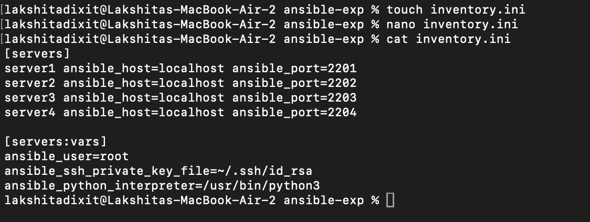

# Step 7: Test Ansible Connectivity (Ping)

We’ll now check if Ansible can talk to all 4 servers.

---

## 7.1 Run Ping Command

In your terminal:
```bash
ansible all -i inventory.ini -m ping
```
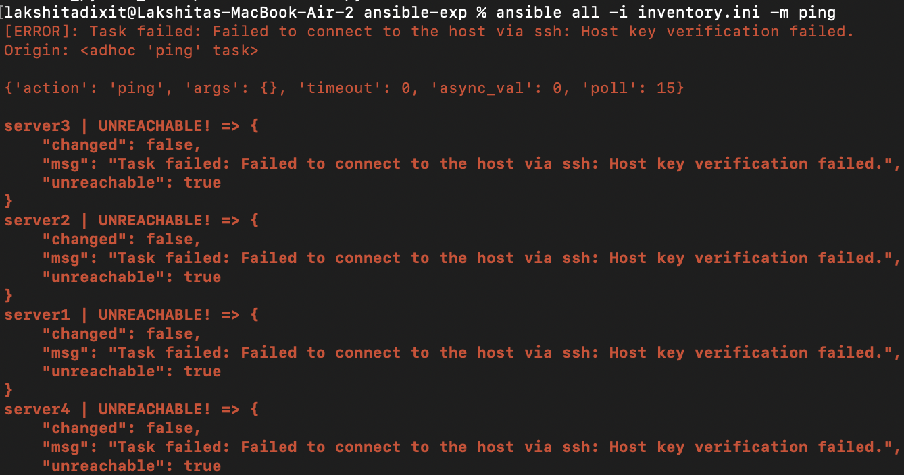
---

## 7.2 Expected Output

You should see something like:
```text
server1 | SUCCESS => { "ping": "pong" }
server2 | SUCCESS => { "ping": "pong" }
server3 | SUCCESS => { "ping": "pong" }
server4 | SUCCESS => { "ping": "pong" }
```

# Problem

Error:
- Host key verification failed

This means:
- Your Mac does not "trust" the SSH servers (containers) yet
- SSH is blocking the connection for security reasons

---

# Fix (Simple and Fast)

We will tell Ansible to skip host key checking (common in labs).

---

## Step 7 Fix

### Option 1 (Quick Command)

Run:
```bash
ANSIBLE_HOST_KEY_CHECKING=False ansible all -i inventory.ini -m ping
```

---

## Expected Result

You should see:
```text
server1 | SUCCESS => { "ping": "pong" }
server2 | SUCCESS => { "ping": "pong" }
server3 | SUCCESS => { "ping": "pong" }
server4 | SUCCESS => { "ping": "pong" }
```

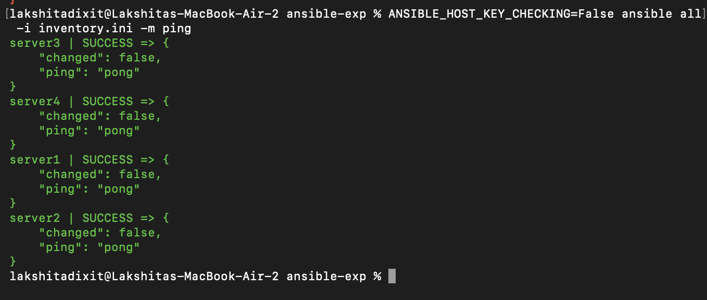
---

## Why This Works

Normally SSH stores known hosts in:
```bash
~/.ssh/known_hosts
```

But your containers:
- Are temporary  
- Keep changing keys  

So verification fails. Disabling host key checking avoids this issue for the experiment.


# Step 8: Create Your First Playbook (Automation)

Now we move from testing to real automation using a YAML playbook.

---

## 8.1 Create Playbook File

```bash
touch playbook1.yml
nano playbook1.yml
```
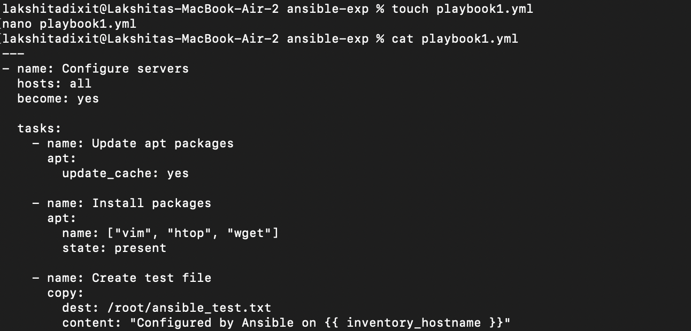

---

## 8.2 Paste This Content

```yaml
---
- name: Configure servers
  hosts: all
  become: yes

  tasks:
    - name: Update apt packages
      apt:
        update_cache: yes

    - name: Install packages
      apt:
        name: ["vim", "htop", "wget"]
        state: present

    - name: Create test file
      copy:
        dest: /root/ansible_test.txt
        content: "Configured by Ansible on {{ inventory_hostname }}"
```

---

## 8.3 Save and Exit

- CTRL + X  
- Y  
- Enter  

---

## 8.4 Run Playbook

```bash
ANSIBLE_HOST_KEY_CHECKING=False ansible-playbook -i inventory.ini playbook1.yml
```
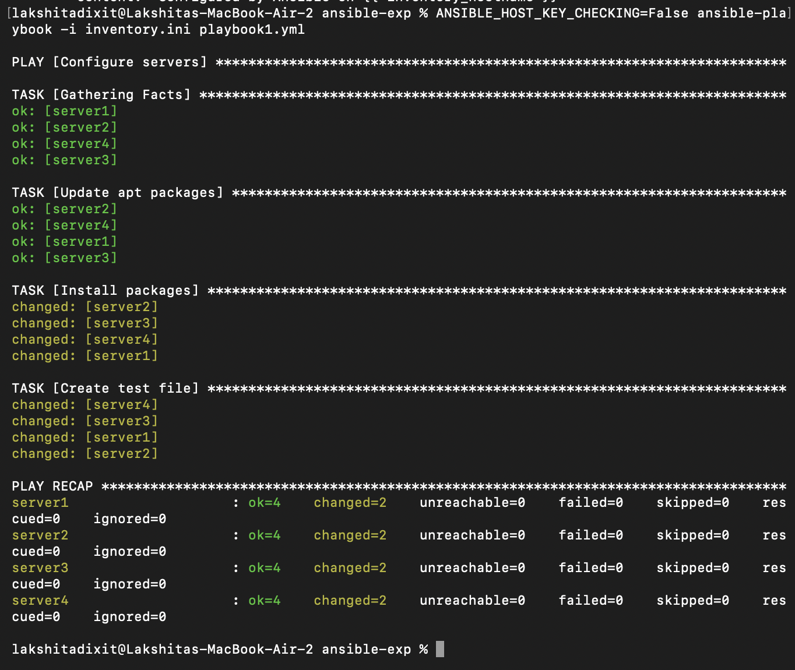
---

## Expected Output

You will see:
- ok  
- changed  

For each server, for example:
```text
server1 : ok=3 changed=2
```

---

# Output Explained

---

## 1. PLAY Started

```text
PLAY [Configure servers]
```

Ansible is running playbook on all servers defined in `inventory.ini`.

---

## 2. Gathering Facts

```text
TASK [Gathering Facts] → ok
```

Ansible collects system information from each server, such as:
- OS  
- IP  
- CPU  

This step is required before executing tasks.

---

## 3. Update apt Packages

```text
ok: [serverX]
```

This means:
- Packages were already up-to-date  
- No changes were required  

This demonstrates **idempotency** (a key concept in Ansible).

---

## 4. Install Packages

```text
changed: [serverX]
```

This means:
- `vim`, `htop`, and `wget` were not installed earlier  
- They have now been installed successfully  

---

## 5. Create Test File

```text
changed: [serverX]
```

This means:
- File `/root/ansible_test.txt` was created  
- The content includes the server name  

---

## Final Summary (Most Important Part)

```text
server1 : ok=4 changed=2
```

Meaning:
- ok=4 → 4 tasks executed successfully  
- changed=2 → 2 tasks actually made changes  

---

## Key Concepts Demonstrated

### 1. Agentless Automation
- No software installed on servers  
- Only SSH is used  

### 2. Idempotency
- Running the playbook again will not duplicate work  

### 3. Scalability
- A single command works across multiple servers  

## What This Does

playbook:
- Updates package lists  
- Installs tools (vim, htop, wget)  
- Creates a file on each server  

This is real automation executed across multiple servers.

# Step 9: Verify the Changes (Proof of Automation)

Right now your playbook claims it created files. Let’s verify that it actually worked.

---

## 9.1 Verify Using Ansible (Best Method)

Run:
```bash
ANSIBLE_HOST_KEY_CHECKING=False ansible all -i inventory.ini -m shell -a "cat /root/ansible_test.txt"
```

---

## Expected Output

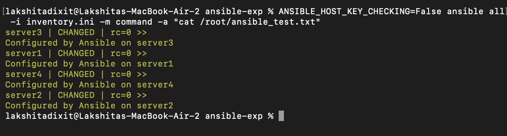

You should see something like:
```text
server1 | SUCCESS => Configured by Ansible on server1
server2 | SUCCESS => Configured by Ansible on server2
server3 | SUCCESS => Configured by Ansible on server3
server4 | SUCCESS => Configured by Ansible on server4
```

---

## What This Proves

- The playbook actually executed on all servers  
- Each server has its own file  
- The content is dynamic (`inventory_hostname`)  
- Automation worked successfully across all machines  

# Step 10: Cleanup (Important for Lab)

After verification, clean up all running containers.

---

## 10.1 Remove Containers

```bash
for i in {1..4}; do
  docker rm -f server$i
done
```
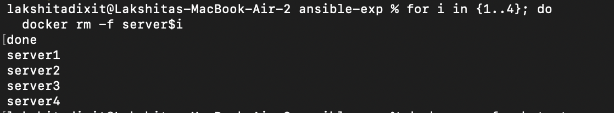
---

## Optional Cleanup

Remove the test container:
```bash
docker rm -f ssh-test-server
```
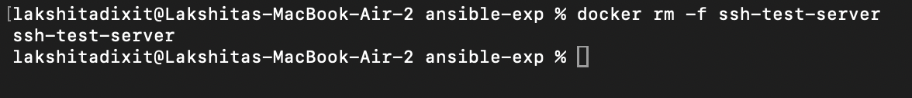

---

## What This Does

- Stops and removes all server containers  
- Frees system resources  
- Keeps your environment clean for future experiments  