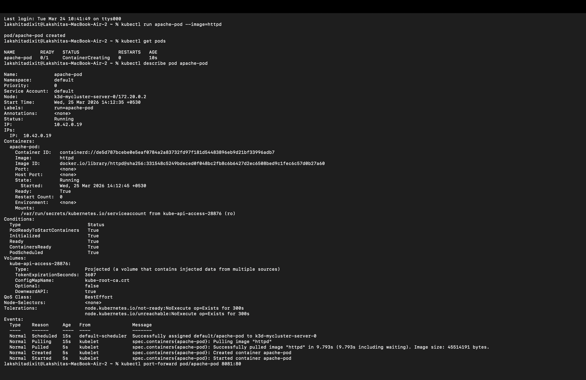
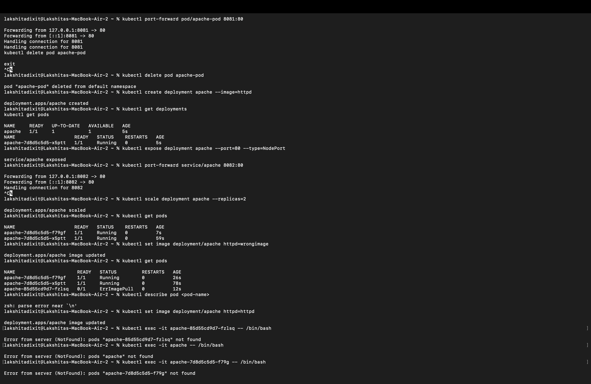
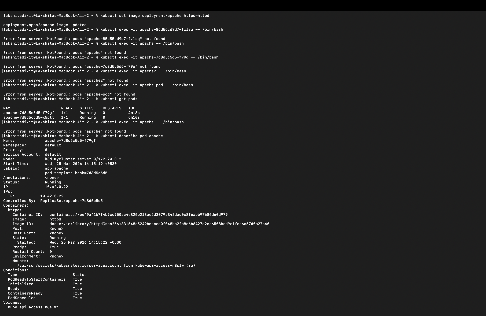
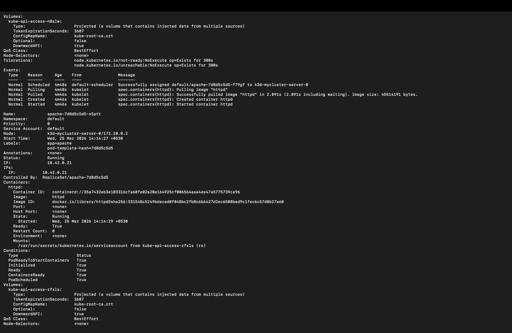
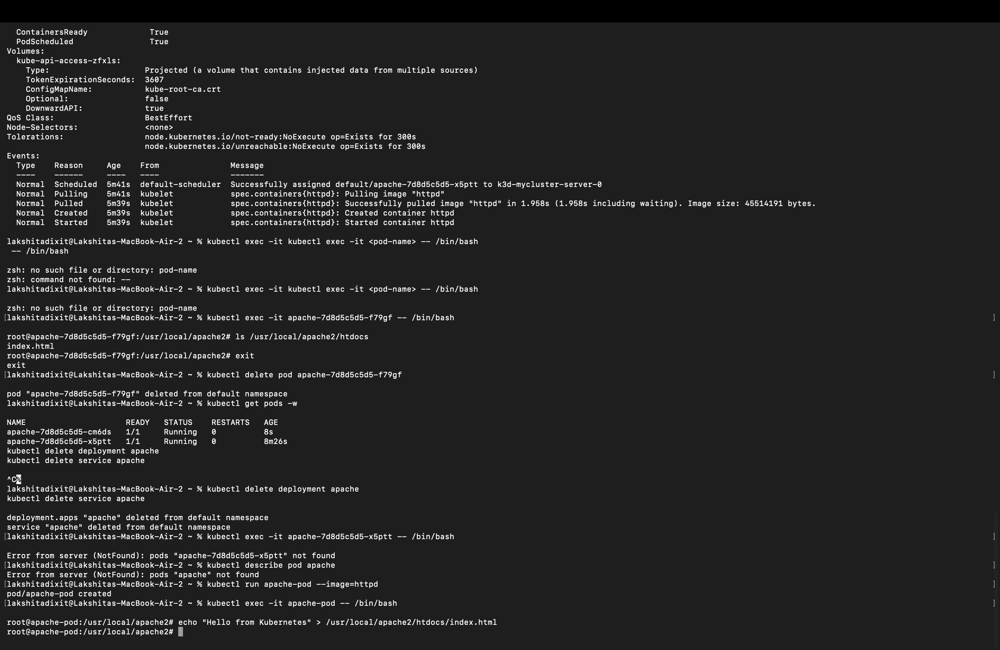

## Lakshita Dixit
## SAP ID : 500125823 

# Apache Web Server Deployment using Kubernetes – Summary

This hands-on task explains how to deploy and manage a simple Apache (httpd) web server using Kubernetes. First, a Pod is created using the httpd image to understand basic container execution and inspection using commands like kubectl run, kubectl get pods, and kubectl describe pod. The application is then accessed locally using port forwarding. The exercise shows that Pods are temporary because if deleted they are not recreated automatically. To solve this, the Pod is converted into a Deployment which provides self-healing, meaning Kubernetes automatically recreates failed Pods. The Deployment is exposed using a Service to allow access, and scaling is demonstrated by increasing replicas to run multiple Pods for better availability and load handling.

The lab also covers debugging and operational skills like intentionally breaking the deployment by changing the container image, identifying errors like ImagePullBackOff, and fixing them. Students also learn how to enter a running container using kubectl exec to explore web files. Another important concept shown is Kubernetes self-healing by deleting a Pod and observing automatic recreation by the Deployment. Finally, the document explains port-forwarding behavior, why it blocks the terminal, and how to run it in the background using &, jobs, ps, kill, tmux, and nohup. The key takeaways include understanding the difference between Pods and Deployments, proper use of Services, scaling benefits, debugging practices, and basic DevOps process management concepts.

## Challenges Faced During the Experiment

1. **Understanding Pod vs Deployment**
   - Initially I was confused about why my Pod was not recreated after deletion.
   - Later I understood that Pods are temporary resources.
   - Deployment is required for self-healing and automatic Pod recreation.

2. **Pod Not Found Error**
   - I repeatedly encountered this error:

   Error from server (NotFound): pods "<pod-name>" not found

- This happened because:
  - I used the wrong Pod name
  - The Pod was already deleted
  - Kubernetes created a new Pod with a different name after scaling
- I learned that I should always check Pod names first using:
  
  kubectl get pods

3. **Port Forward Command Blocking Terminal**
- When I ran port forwarding, the terminal appeared stuck.
- I initially thought the command had failed.
- Later I understood it runs in the foreground because it maintains a live tunnel.

4. **Debugging ImagePullBackOff Error**
- When I intentionally used the wrong image, the Pod failed.
- The status showed:

 ImagePullBackOff

